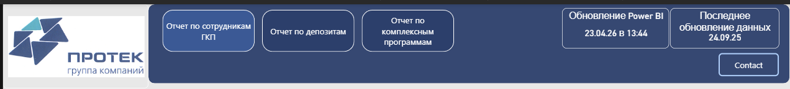
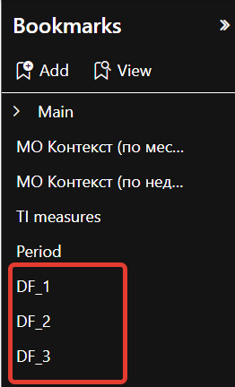
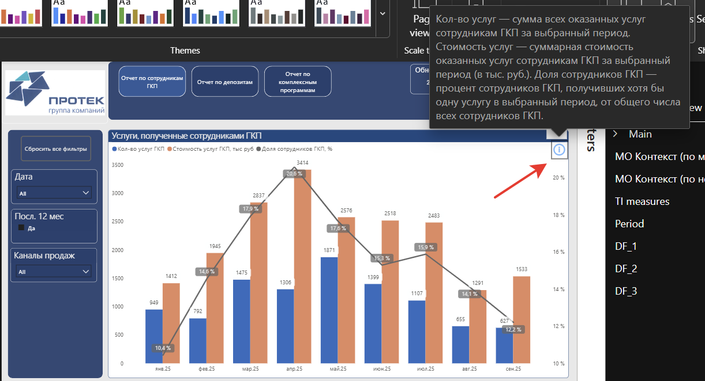
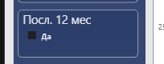
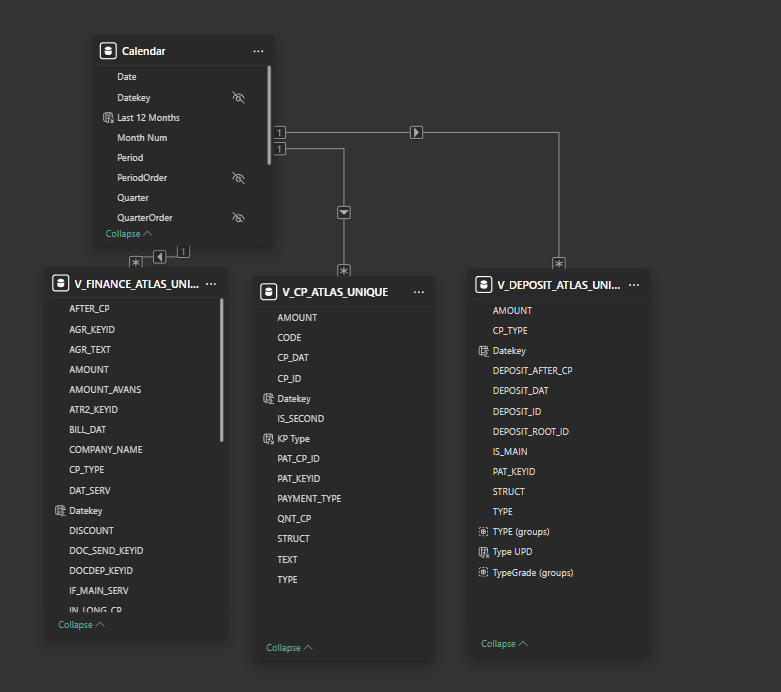
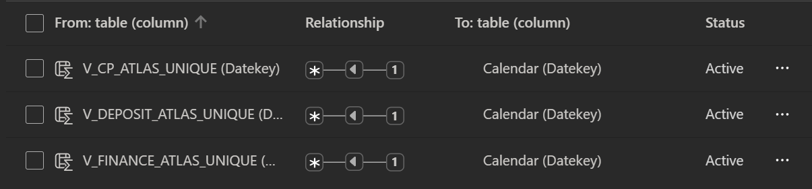
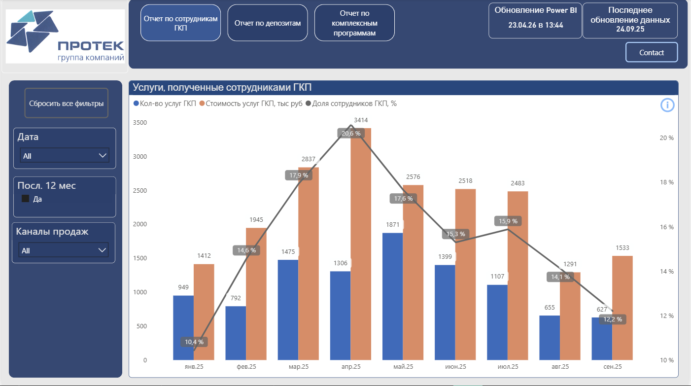
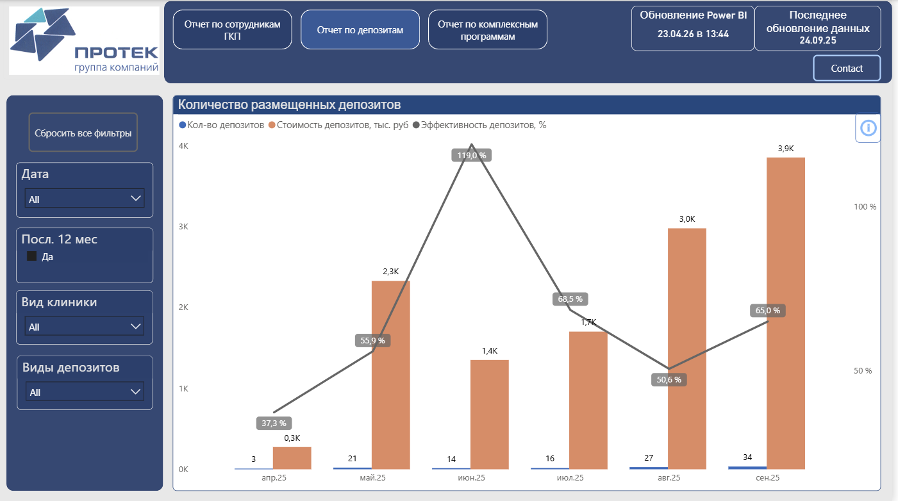
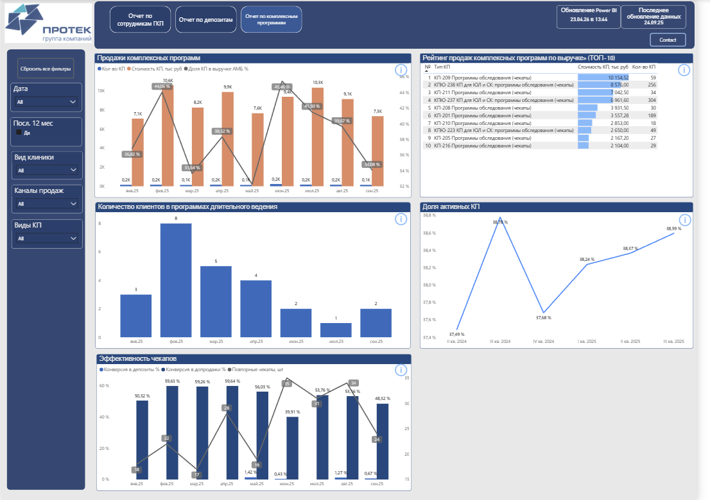

# 📊 Clinic Analytics Dashboard

Дашборд для анализа ключевых показателей Медицинского центра Атлас (группа компаний ПРОТЕК). Тестовое задание для Билабс.

**Стек:** `Power BI` `DAX` `Power Query` `PostgreSQL`

---

## Общая структура

**Страницы:**
- Отчёт по сотрудникам ГКП
- Отчёт по депозитам
- Отчёт по комплексным программам

**Навигация** — кнопки в шапке, переключают между страницами.

**Шапка (на каждой странице):**
- Логотип и цветовая гамма согласно брендбуку компании
- Кнопки навигации
- Плашка «Обновление Power BI» — дата и время последнего обновления файла
- Плашка «Последнее обновление данных» — максимальная дата в источниках
- Кнопка **Contact** — ссылка для связи (Telegram / email / тикет Jira)



**На каждой странице:**
- Кнопка «Сбросить все фильтры» — реализована через букмарки (DF_1, DF_2, DF_3)




- Иконка ℹ️ на каждом графике — при наведении появляется плашка с описанием метрик и логикой расчёта



- Слайсер «Посл. 12 мес» — по умолчанию активен фильтр «Да»



**Меры для плашки обновления:**
```dax
PBI Refresh Date = 
VAR d = NOW()
RETURN FORMAT(d, "dd.mm.yy в hh:mm", "ru-RU")
```

---

## Power Query — источники данных

Подключение к PostgreSQL настроено в Power Query. Все преобразования сделаны на стороне Power Query.

**Факт-таблицы (3 шт.):**
- `V_FINANCE_ATLAS_UNIQUE` — финансы и услуги
- `V_CP_ATLAS_UNIQUE` — комплексные программы
- `V_DEPOSIT_ATLAS_UNIQUE` — депозиты клиентов

**Справочник:**
- `PATIENT` — справочник пациентов (подключён, в визуализациях не используется)

---

## Связи

Все три факт-таблицы связаны с `Calendar` через поле `Datekey` (many-to-one). Прямых связей между факт-таблицами нет — кросс-табличные вычисления реализованы через DAX (`INTERSECT`, `CALCULATETABLE`).




---

## Таблица Calendar

```dax
Calendar = 
ADDCOLUMNS(
    CALENDARAUTO(),
    "Year",        YEAR([Date]),
    "Month Num",   MONTH([Date]),
    "Year Month",  FORMAT([Date], "YYYY-MM"),
    "Period",      FORMAT([Date], "MMM.YY", "ru-RU"),
    "Quarter",     
        SWITCH(
            QUARTER([Date]),
            1, "I кв. "   & YEAR([Date]),
            2, "II кв. "  & YEAR([Date]),
            3, "III кв. " & YEAR([Date]),
            4, "IV кв. "  & YEAR([Date])
        ),
    "QuarterOrder", YEAR([Date]) * 10 + QUARTER([Date]),
    "Datekey",     YEAR([Date]) * 10000 + MONTH([Date]) * 100 + DAY([Date]),
    "PeriodOrder", VALUE(FORMAT([Date], "YYYYMM"))
)
```

> ⚠️ Сортировка: `Period` сортируется по `PeriodOrder`, `Quarter` — по `QuarterOrder`.

**Доп. столбец `Last 12 Months`:**
```dax
Last 12 Months = 
VAR MaxDate       = CALCULATE(MAX('Calendar'[Date]), ALL('Calendar'))
VAR CurMonthStart = DATE(YEAR(MaxDate), MONTH(MaxDate), 1)
VAR StartDate     = EOMONTH(CurMonthStart, -12) + 1
RETURN
    IF('Calendar'[Date] >= StartDate && 'Calendar'[Date] <= MaxDate, "Да", "Нет")
```

---

## Вычисляемые столбцы в источниках

**V_CP_ATLAS_UNIQUE:**
```dax
KP Type = V_CP_ATLAS_UNIQUE[CODE] & " " & V_CP_ATLAS_UNIQUE[TYPE]
```

**V_DEPOSIT_ATLAS_UNIQUE:**
```dax
Type UPD = 
SWITCH(TRUE(), 
    'V_DEPOSIT_ATLAS_UNIQUE'[TYPE (groups)] = "Семейный депозит ЭСТ", "ЭСТ",
    'V_DEPOSIT_ATLAS_UNIQUE'[TYPE (groups)] = "Семейный депозит АМБ", "АМБ",
    blank()
)
```

> Создан для краткого названия типа депозита. В итоговых визуализациях не используется — у ЭСТ депозитов нет основных взносов (IS_MAIN=1) в тестовом датасете.

---

## Страница 1 — Отчёт по сотрудникам ГКП

**Цель:** смотрим активность сотрудников ГКП и их родственников в клинике.

**Фильтры:** дата, посл. 12 мес, каналы продаж.

**График «Услуги, полученные сотрудниками ГКП»** — комбо: два столбца (кол-во и стоимость) + линия доли на правой оси.



**Меры:**
```dax
ГКП = 
CALCULATE(
    DISTINCTCOUNT('V_FINANCE_ATLAS_UNIQUE'[PAT_KEYID]),
    'V_FINANCE_ATLAS_UNIQUE'[IS_GKP] = 1
)
```
```dax
Кол-во услуг ГКП = 
CALCULATE(
    SUM('V_FINANCE_ATLAS_UNIQUE'[QTY]),
    'V_FINANCE_ATLAS_UNIQUE'[IS_GKP] = 1
)
```
```dax
Стоимость услуг ГКП, тыс руб = 
DIVIDE(
    CALCULATE(
        SUM('V_FINANCE_ATLAS_UNIQUE'[AMOUNT]),
        'V_FINANCE_ATLAS_UNIQUE'[IS_GKP] = 1
    ),
    1000
)
```
```dax
Доля сотрудников ГКП, % = 
DIVIDE(
    CALCULATE(
        DISTINCTCOUNT('V_FINANCE_ATLAS_UNIQUE'[PAT_KEYID]),
        'V_FINANCE_ATLAS_UNIQUE'[IS_GKP] = 1
    ),
    CALCULATE(
        MAX('V_FINANCE_ATLAS_UNIQUE'[QNT_GKP]),
        'V_FINANCE_ATLAS_UNIQUE'[IS_GKP] = 1,
        REMOVEFILTERS('Calendar')
    )
)
```

> Знаменатель — константа QNT_GKP = 680 (общее число сотрудников ГКП по договору), не зависит от периода.

---

## Страница 2 — Отчёт по депозитам

**Цель:** смотрим сколько депозитов размещается и насколько эффективно клиенты их используют.

**Фильтры:** дата, посл. 12 мес, вид клиники, виды депозитов.

**График «Депозиты клиентов»** — комбо: два столбца (кол-во и стоимость) + линия эффективности.



**Меры:**
```dax
Кол-во депозитов = 
CALCULATE(
    COUNT(V_DEPOSIT_ATLAS_UNIQUE[DEPOSIT_ID]),
    V_DEPOSIT_ATLAS_UNIQUE[IS_MAIN] = 1,
    ISBLANK(V_DEPOSIT_ATLAS_UNIQUE[DEPOSIT_ROOT_ID])
)
```

> Считаем только основные взносы: IS_MAIN = 1 и DEPOSIT_ROOT_ID IS NULL.

```dax
Стоимость депозитов, тыс. руб = 
DIVIDE(
    CALCULATE(
        SUM(V_DEPOSIT_ATLAS_UNIQUE[AMOUNT]),
        ISBLANK(V_DEPOSIT_ATLAS_UNIQUE[DEPOSIT_ROOT_ID]),
        V_DEPOSIT_ATLAS_UNIQUE[IS_MAIN] = 1
    ),
    1000
)
```
```dax
Эффективность депозитов, % = 
DIVIDE(
    CALCULATE(
        SUM(V_DEPOSIT_ATLAS_UNIQUE[AMOUNT]),
        NOT ISBLANK(V_DEPOSIT_ATLAS_UNIQUE[DEPOSIT_ROOT_ID])
    ),
    CALCULATE(
        SUM(V_DEPOSIT_ATLAS_UNIQUE[AMOUNT]),
        ISBLANK(V_DEPOSIT_ATLAS_UNIQUE[DEPOSIT_ROOT_ID])
    )
)
```

> Числитель — суммы с заполненным DEPOSIT_ROOT_ID (использованные средства). Знаменатель — суммы с пустым DEPOSIT_ROOT_ID (внесённые средства).

---

## Страница 3 — Отчёт по комплексным программам

**Цель:** смотрим продажи КП, активность клиентов в программах и конверсии.

**Фильтры:** дата, посл. 12 мес, вид клиники, каналы продаж, виды КП.

**Визуализации:**
- **«Продажи комплексных программ»** — комбо: столбцы + линия доли в выручке АМБ + константная линия план 15%
- **«ТОП-10 КП по выручке»** — таблица с рангом, названием и выручкой
- **«Количество клиентов в программах длительного ведения»** — столбчатая, помесячно
- **«Доля активных КП»** — линейная, поквартально
- **«Эффективность чекапов»** — комбо: столбцы (конверсии) + линия (повторные чекапы)



**Меры:**
```dax
Кол-во КП = 
DISTINCTCOUNT(V_CP_ATLAS_UNIQUE[PAT_CP_ID])
```
```dax
Стоимость КП, тыс руб = 
DIVIDE(SUM(V_CP_ATLAS_UNIQUE[AMOUNT]), 1000)
```
```dax
Доля КП в выручке АМБ % = 
DIVIDE(
    SUM(V_CP_ATLAS_UNIQUE[AMOUNT]),
    CALCULATE(
        SUM(V_FINANCE_ATLAS_UNIQUE[AMOUNT]),
        V_FINANCE_ATLAS_UNIQUE[STEXT] = "АМБ"
    )
)
```
```dax
Повторные чекапы, шт = 
CALCULATE(
    DISTINCTCOUNT(V_CP_ATLAS_UNIQUE[PAT_CP_ID]),
    V_CP_ATLAS_UNIQUE[IS_SECOND] = 1
)
```
```dax
Клиенты в длительном ведении = 
CALCULATE(
    DISTINCTCOUNT(V_FINANCE_ATLAS_UNIQUE[PAT_KEYID]),
    V_FINANCE_ATLAS_UNIQUE[IN_LONG_CP] = 1
)
```
```dax
Доля активных КП % = 
DIVIDE(
    DISTINCTCOUNT(V_CP_ATLAS_UNIQUE[CP_ID]),
    MAX(V_CP_ATLAS_UNIQUE[QNT_CP])
)
```
```dax
Конверсия в депозиты % = 
DIVIDE(
    CALCULATE(
        DISTINCTCOUNT(V_DEPOSIT_ATLAS_UNIQUE[PAT_KEYID]),
        V_DEPOSIT_ATLAS_UNIQUE[DEPOSIT_AFTER_CP] = 1
    ),
    DISTINCTCOUNT(V_CP_ATLAS_UNIQUE[PAT_KEYID])
)
```
```dax
Конверсия в допродажи % = 
VAR PatientsKP = 
    CALCULATETABLE(VALUES(V_CP_ATLAS_UNIQUE[PAT_KEYID]))
VAR PatientsAfterCP =
    CALCULATETABLE(
        VALUES(V_FINANCE_ATLAS_UNIQUE[PAT_KEYID]),
        V_FINANCE_ATLAS_UNIQUE[AFTER_CP] = 1
    )
RETURN
DIVIDE(
    COUNTROWS(INTERSECT(PatientsKP, PatientsAfterCP)),
    COUNTROWS(PatientsKP)
)
```
```dax
Ранг КП = 
RANKX(
    ALL(V_CP_ATLAS_UNIQUE[KP Type]),
    [Стоимость КП, тыс руб],
    ,
    DESC,
    DENSE
)
```
