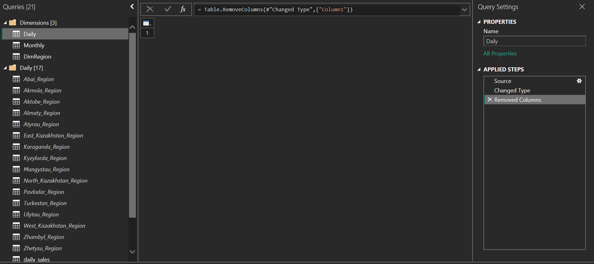
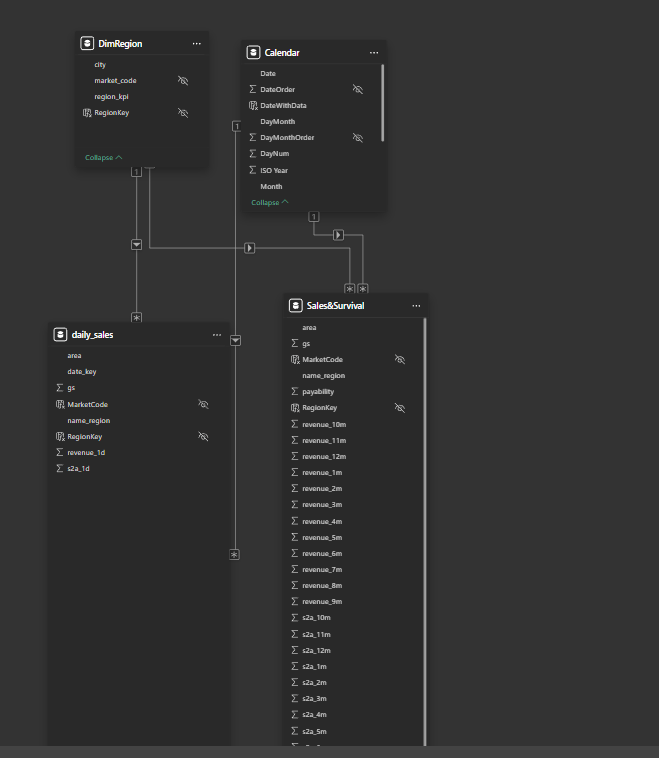
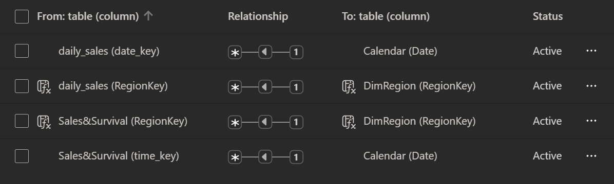
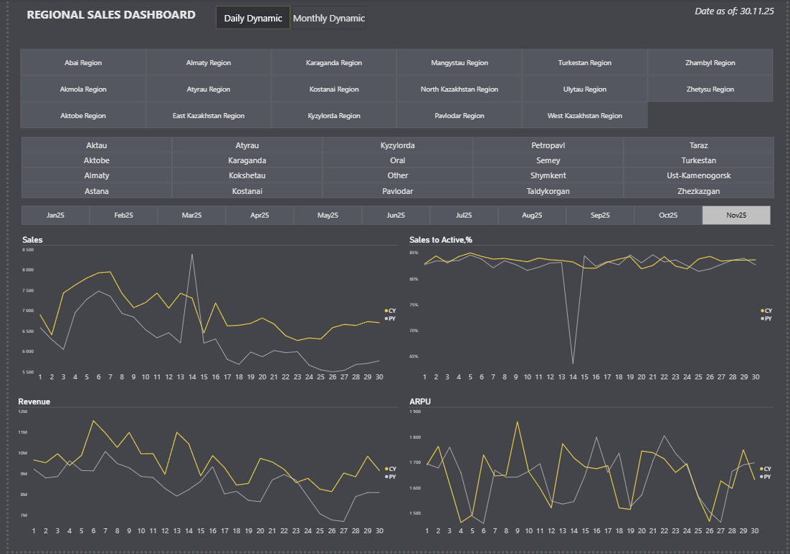
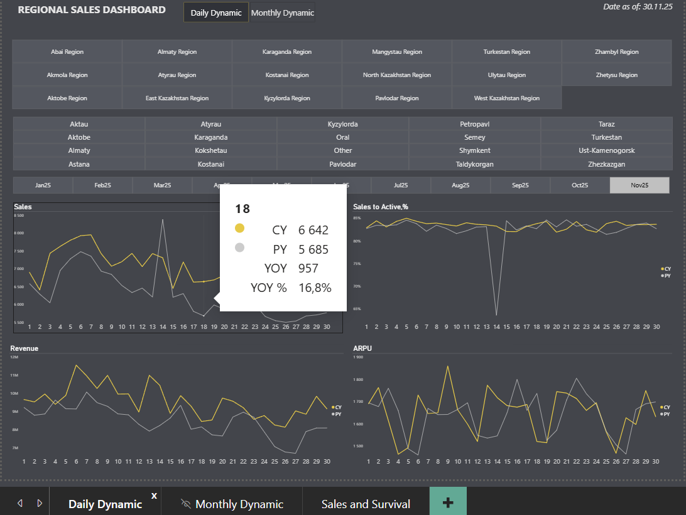
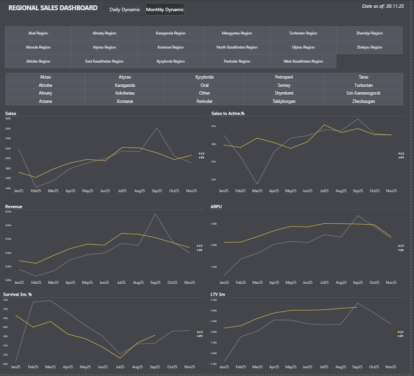
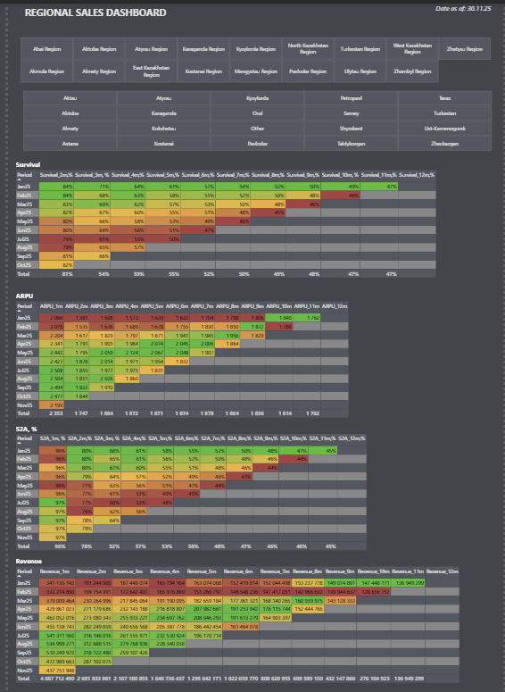

# 📊 Regional Sales Dashboard

Power BI dashboard for sales analysis, customer survival, and ARPU across all 17 regions and key cities of Kazakhstan. Daily and monthly views are implemented as **separate report pages**.

---

## General Structure

**Report pages:** Daily Dynamic · Monthly Dynamic · Sales and Survival

**Header (every page):** dashboard title + `Date as of: DD.MM.YY` badge top right. Toggle buttons **Daily Dynamic / Monthly Dynamic** for page navigation.

**Filters (every page):**
- Region slicer — 17 oblasts
- City slicer — 20+ cities
- Month bar Jan–Dec (Daily Dynamic only)

---

## Power Query

**Data source:** Excel files — one per region (16 files) + one monthly cohort file.

**Folder structure in Power Query Editor:**

```
Dimensions [3]
├── Daily      — reference query
├── Monthly    — reference query
└── DimRegion  — region & city reference

Daily [17]
├── Abai_Region
├── Akmola_Region
├── Aktobe_Region
├── Almaty_Region
├── Atyrau_Region
├── East_Kazakhstan_Region
├── Karaganda_Region
├── Kyzylorda_Region
├── Mangystau_Region
├── North_Kazakhstan_Region
├── Pavlodar_Region
├── Turkestan_Region
├── Ulytau_Region
├── West_Kazakhstan_Region
├── Zhambyl_Region
├── Zhetysu_Region
└── daily_sales   ← Append of all 16 regional tables

Monthly [1]
└── Sales&Survival
```



**Applied steps per regional table:** Source → Changed Type → Removed Columns (Column1)

**Append:** All 16 regional tables are combined via **Append Queries (New Query)** into the single fact table `daily_sales`. Region and city names are translated to English in the source files before load.

---

## Data Model

| Table | Type | Description |
|---|---|---|
| `daily_sales` | Fact | Daily sales — Append of 16 regional tables |
| `Sales&Survival` | Fact | Monthly cohort data |
| `DimRegion` | Dimension | Region & city reference |
| `Calendar` | Dimension | Calculated date table (DAX) |

**Relationships — all active, many-to-one (`*` → `1`):**

| From | To |
|---|---|
| `daily_sales[date_key]` | `Calendar[Date]` |
| `daily_sales[RegionKey]` | `DimRegion[RegionKey]` |
| `Sales&Survival[time_key]` | `Calendar[Date]` |
| `Sales&Survival[RegionKey]` | `DimRegion[RegionKey]` |





---

## Table View — Schemas & Calculated Columns

### daily_sales

| Column | Type | Description |
|---|---|---|
| `date_key` | Date | Daily date key |
| `name_region` | Text | Region name (English) |
| `area` | Text | City |
| `gs` | Integer | Sales count |
| `s2a_1d` | Decimal | Sales to Active % (daily) |
| `revenue_1d` | Decimal | Revenue (daily) |
| `MarketCode` | Calculated | Market code |
| `RegionKey` | Calculated | Join key to DimRegion |

**Calculated column — MarketCode:**
```dax
MarketCode = SWITCH(daily_sales[name_region],
    "Zhambyl Region",          "TRZ",
    "Mangystau Region",        "AKT",
    "North Kazakhstan Region", "PTP",
    "Aktobe Region",           "ATB",
    "Pavlodar Region",         "PVL",
    "Turkestan Region",        "SHM",
    "East Kazakhstan Region",  "OSK",
    "Atyrau Region",           "ATR",
    "West Kazakhstan Region",  "ORA",
    "Kostanai Region",         "KOS",
    "Akmola Region",           "AST",
    "Karaganda Region",        "KAR",
    "Almaty Region",           "KZT",
    "Kyzylorda Region",        "KZO",
    "Zhetysu Region",          "JTS",
    "Abai Region",             "Abai",
    "Ulytau Region",           "ULT",
    daily_sales[name_region]
)
```

**Calculated column — RegionKey:**
```dax
RegionKey = daily_sales[area] & daily_sales[MarketCode]
```

---

### Sales&Survival

| Column | Type | Description |
|---|---|---|
| `time_key` | Date | Monthly date key |
| `name_region` | Text | Region name (English) |
| `area` | Text | City |
| `gs` | Integer | Sales count |
| `payability` | Decimal | Payability rate |
| `revenue_1m … revenue_12m` | Decimal | Revenue by cohort month |
| `s2a_1m … s2a_12m` | Decimal | Sales to Active by cohort month |
| `MarketCode` | Calculated | Market code |
| `RegionKey` | Calculated | Join key to DimRegion |

**Calculated column — MarketCode:**
```dax
MarketCode = SWITCH('Sales&Survival'[name_region],
    "Zhambyl Region",          "TRZ",
    "Mangystau Region",        "AKT",
    "North Kazakhstan Region", "PTP",
    "Aktobe Region",           "ATB",
    "Pavlodar Region",         "PVL",
    "Turkestan Region",        "SHM",
    "East Kazakhstan Region",  "OSK",
    "Atyrau Region",           "ATR",
    "West Kazakhstan Region",  "ORA",
    "Kostanai Region",         "KOS",
    "Akmola Region",           "AST",
    "Karaganda Region",        "KAR",
    "Almaty Region",           "KZT",
    "Kyzylorda Region",        "KZO",
    "Zhetysu Region",          "JTS",
    "Abai Region",             "Abai",
    "Ulytau Region",           "ULT",
    'Sales&Survival'[name_region]
)
```

**Calculated column — RegionKey:**
```dax
RegionKey = 'Sales&Survival'[area] & 'Sales&Survival'[MarketCode]
```

---

### DimRegion

| Column | Type | Description |
|---|---|---|
| `city` | Text | City name |
| `market_code` | Text | Market code (AST, ATB, KZT…) |
| `region_kpi` | Text | Short region label |
| `RegionKey` | Text | Join key (city + market_code) |

---

### Calendar

**Columns:**

| Column | Type | Description |
|---|---|---|
| `Date` | Date | Base date column |
| `Year` | Integer | Year number |
| `Month` | Text | Month name (January…) |
| `Period` | Text | Short period label (Nov25) |
| `DayNum` | Text | Day number in month |
| `WeekNum` | Integer | ISO week number |
| `ISO Year` | Integer | ISO year |
| `DayMonth` | Text | Day + month label (Nov 30) |
| `DayMonthOrder` | Text | Sort key yyyymmdd |
| `DateOrder` | Integer | Sort key YYYYMM |
| `DateWithData` | Calculated | TRUE if date ≤ last date with data |

**Calculated table — Calendar:**
```dax
Calendar = ADDCOLUMNS(
    CALENDAR(
        DATE(YEAR(MIN(daily_sales[date_key])), 1, 1),
        DATE(YEAR(MAX(daily_sales[date_key])), 12, 31)
    ),
    "Year",          YEAR([Date]),
    "Month",         FORMAT([Date], "mmmm"),
    "Period",        FORMAT([Date], "MMMmyy"),
    "DayNum",        FORMAT([Date], "D"),
    "WeekNum",       WEEKNUM([Date], 21),
    "ISO Year",      YEAR([Date] + 26 - WEEKNUM([Date], 21)),
    "DayMonth",      FORMAT([Date], "MMM DD"),
    "DayMonthOrder", FORMAT([Date], "yyyymmdd"),
    "DateOrder",     VALUE(FORMAT([Date], "YYYYMM"))
)
```

> Date range built from `MIN` / `MAX` of `daily_sales[date_key]`. `DateOrder` used for period sorting. `WeekNum` uses ISO mode 21 — week starts Monday.

**Calculated column — DateWithData:**
```dax
DateWithData =
'Calendar'[Date] <= MAX(daily_sales[date_key])
```

> Used as a filter in PY measures to exclude future dates that have no data.

**Measures on Calendar:**
```dax
MaxDate = "Date as of: " & FORMAT(MAX(daily_sales[date_key]), "dd.mm.yy")
```

```dax
ShowValueForDates =
VAR LastDateWithData = CALCULATE(MAX(daily_sales[date_key]), REMOVEFILTERS())
VAR FirstDateVisible = MIN('Calendar'[Date])
VAR Result = FirstDateVisible <= LastDateWithData
RETURN
Result
```

> `MaxDate` — dynamic label displayed in the dashboard header (e.g. `Date as of: 30.11.25`).
> `ShowValueForDates` — gate measure used in PY calculations to suppress blanks for periods beyond the last loaded date.

---

## Report View — Pages & Measures

### Page 1 — Daily Dynamic

Line charts: **Sales, Sales to Active %, Revenue, ARPU**
X-axis = day number within selected month. CY (gold) vs PY (grey).



**Tooltip fields on every chart:** day number · CY · PY · YOY · YOY %



```dax
Sales CY = SUM(daily_sales[gs])
```
```dax
Sales PY =
CALCULATE(
    SUM(daily_sales[gs]),
    SAMEPERIODLASTYEAR(Calendar[Date])
)
```
```dax
Sales YOY = [Sales CY] - [Sales PY]
```
```dax
Sales YOY % = DIVIDE([Sales YOY], [Sales PY])
```
```dax
Revenue CY = SUM(daily_sales[revenue_1d])
```
```dax
Revenue PY =
CALCULATE(
    SUM(daily_sales[revenue_1d]),
    SAMEPERIODLASTYEAR(Calendar[Date])
)
```
```dax
Revenue YOY = [Revenue CY] - [Revenue PY]
```
```dax
Revenue YOY % = DIVIDE([Revenue YOY], [Revenue PY])
```
```dax
S2A CY = AVERAGE(daily_sales[s2a_1d])
```
```dax
S2A PY =
CALCULATE(
    AVERAGE(daily_sales[s2a_1d]),
    SAMEPERIODLASTYEAR(Calendar[Date])
)
```
```dax
ARPU CY = DIVIDE([Revenue CY], [Sales CY])
```
```dax
ARPU PY = DIVIDE([Revenue PY], [Sales PY])
```

---

### Page 2 — Monthly Dynamic

Line charts: **Sales, Sales to Active %, Revenue, ARPU, Survival 3m %, LTV 3m**
X-axis = month (Jan–Dec). CY vs PY.



```dax
Sales Monthly CY = SUM(daily_sales[gs])
```
```dax
Sales Monthly PY =
CALCULATE(
    SUM(daily_sales[gs]),
    SAMEPERIODLASTYEAR(Calendar[Date])
)
```
```dax
Revenue Monthly CY = SUM(daily_sales[revenue_1d])
```
```dax
Revenue Monthly PY =
CALCULATE(
    SUM(daily_sales[revenue_1d]),
    SAMEPERIODLASTYEAR(Calendar[Date])
)
```
```dax
S2A Monthly CY = AVERAGE(daily_sales[s2a_1d])
```
```dax
S2A Monthly PY =
CALCULATE(
    AVERAGE(daily_sales[s2a_1d]),
    SAMEPERIODLASTYEAR(Calendar[Date])
)
```
```dax
ARPU Monthly CY = DIVIDE([Revenue Monthly CY], [Sales Monthly CY])
```
```dax
ARPU Monthly PY = DIVIDE([Revenue Monthly PY], [Sales Monthly PY])
```
```dax
Survival 3m CY = AVERAGE('Sales&Survival'[s2a_3m])
```
```dax
Survival 3m PY =
CALCULATE(
    AVERAGE('Sales&Survival'[s2a_3m]),
    SAMEPERIODLASTYEAR(Calendar[Date])
)
```
```dax
LTV 3m CY = AVERAGE('Sales&Survival'[revenue_3m])
```
```dax
LTV 3m PY =
CALCULATE(
    AVERAGE('Sales&Survival'[revenue_3m]),
    SAMEPERIODLASTYEAR(Calendar[Date])
)
```

---

### Page 3 — Sales and Survival

Four cohort matrix tables with conditional formatting (green → yellow → red).
Rows = cohort period (Jan25 … Oct25 + Total). Columns = months after first sale (1m → 12m).



---

#### Survival % — 11 measures (2m → 12m)

```dax
Survival 2m % =
DIVIDE(SUM('Sales&Survival'[s2a_2m]), SUM('Sales&Survival'[gs]))
```
```dax
Survival 3m % =
DIVIDE(SUM('Sales&Survival'[s2a_3m]), SUM('Sales&Survival'[gs]))
```
```dax
Survival 4m % =
DIVIDE(SUM('Sales&Survival'[s2a_4m]), SUM('Sales&Survival'[gs]))
```
```dax
Survival 5m % =
DIVIDE(SUM('Sales&Survival'[s2a_5m]), SUM('Sales&Survival'[gs]))
```
```dax
Survival 6m % =
DIVIDE(SUM('Sales&Survival'[s2a_6m]), SUM('Sales&Survival'[gs]))
```
```dax
Survival 7m % =
DIVIDE(SUM('Sales&Survival'[s2a_7m]), SUM('Sales&Survival'[gs]))
```
```dax
Survival 8m % =
DIVIDE(SUM('Sales&Survival'[s2a_8m]), SUM('Sales&Survival'[gs]))
```
```dax
Survival 9m % =
DIVIDE(SUM('Sales&Survival'[s2a_9m]), SUM('Sales&Survival'[gs]))
```
```dax
Survival 10m % =
DIVIDE(SUM('Sales&Survival'[s2a_10m]), SUM('Sales&Survival'[gs]))
```
```dax
Survival 11m % =
DIVIDE(SUM('Sales&Survival'[s2a_11m]), SUM('Sales&Survival'[gs]))
```
```dax
Survival 12m % =
DIVIDE(SUM('Sales&Survival'[s2a_12m]), SUM('Sales&Survival'[gs]))
```

---

#### ARPU — 12 measures (1m → 12m)

```dax
ARPU 1m =
DIVIDE(SUM('Sales&Survival'[revenue_1m]), SUM('Sales&Survival'[gs]))
```
```dax
ARPU 2m =
DIVIDE(SUM('Sales&Survival'[revenue_2m]), SUM('Sales&Survival'[gs]))
```
```dax
ARPU 3m =
DIVIDE(SUM('Sales&Survival'[revenue_3m]), SUM('Sales&Survival'[gs]))
```
```dax
ARPU 4m =
DIVIDE(SUM('Sales&Survival'[revenue_4m]), SUM('Sales&Survival'[gs]))
```
```dax
ARPU 5m =
DIVIDE(SUM('Sales&Survival'[revenue_5m]), SUM('Sales&Survival'[gs]))
```
```dax
ARPU 6m =
DIVIDE(SUM('Sales&Survival'[revenue_6m]), SUM('Sales&Survival'[gs]))
```
```dax
ARPU 7m =
DIVIDE(SUM('Sales&Survival'[revenue_7m]), SUM('Sales&Survival'[gs]))
```
```dax
ARPU 8m =
DIVIDE(SUM('Sales&Survival'[revenue_8m]), SUM('Sales&Survival'[gs]))
```
```dax
ARPU 9m =
DIVIDE(SUM('Sales&Survival'[revenue_9m]), SUM('Sales&Survival'[gs]))
```
```dax
ARPU 10m =
DIVIDE(SUM('Sales&Survival'[revenue_10m]), SUM('Sales&Survival'[gs]))
```
```dax
ARPU 11m =
DIVIDE(SUM('Sales&Survival'[revenue_11m]), SUM('Sales&Survival'[gs]))
```
```dax
ARPU 12m =
DIVIDE(SUM('Sales&Survival'[revenue_12m]), SUM('Sales&Survival'[gs]))
```

---

#### S2A % — 12 measures (1m → 12m)

```dax
S2A 1m % =
DIVIDE(SUM('Sales&Survival'[s2a_1m]), SUM('Sales&Survival'[gs]))
```
```dax
S2A 2m % =
DIVIDE(SUM('Sales&Survival'[s2a_2m]), SUM('Sales&Survival'[gs]))
```
```dax
S2A 3m % =
DIVIDE(SUM('Sales&Survival'[s2a_3m]), SUM('Sales&Survival'[gs]))
```
```dax
S2A 4m % =
DIVIDE(SUM('Sales&Survival'[s2a_4m]), SUM('Sales&Survival'[gs]))
```
```dax
S2A 5m % =
DIVIDE(SUM('Sales&Survival'[s2a_5m]), SUM('Sales&Survival'[gs]))
```
```dax
S2A 6m % =
DIVIDE(SUM('Sales&Survival'[s2a_6m]), SUM('Sales&Survival'[gs]))
```
```dax
S2A 7m % =
DIVIDE(SUM('Sales&Survival'[s2a_7m]), SUM('Sales&Survival'[gs]))
```
```dax
S2A 8m % =
DIVIDE(SUM('Sales&Survival'[s2a_8m]), SUM('Sales&Survival'[gs]))
```
```dax
S2A 9m % =
DIVIDE(SUM('Sales&Survival'[s2a_9m]), SUM('Sales&Survival'[gs]))
```
```dax
S2A 10m % =
DIVIDE(SUM('Sales&Survival'[s2a_10m]), SUM('Sales&Survival'[gs]))
```
```dax
S2A 11m % =
DIVIDE(SUM('Sales&Survival'[s2a_11m]), SUM('Sales&Survival'[gs]))
```
```dax
S2A 12m % =
DIVIDE(SUM('Sales&Survival'[s2a_12m]), SUM('Sales&Survival'[gs]))
```

---

#### Revenue cohort — 12 measures (1m → 12m)

```dax
Revenue 1m = SUM('Sales&Survival'[revenue_1m])
```
```dax
Revenue 2m = SUM('Sales&Survival'[revenue_2m])
```
```dax
Revenue 3m = SUM('Sales&Survival'[revenue_3m])
```
```dax
Revenue 4m = SUM('Sales&Survival'[revenue_4m])
```
```dax
Revenue 5m = SUM('Sales&Survival'[revenue_5m])
```
```dax
Revenue 6m = SUM('Sales&Survival'[revenue_6m])
```
```dax
Revenue 7m = SUM('Sales&Survival'[revenue_7m])
```
```dax
Revenue 8m = SUM('Sales&Survival'[revenue_8m])
```
```dax
Revenue 9m = SUM('Sales&Survival'[revenue_9m])
```
```dax
Revenue 10m = SUM('Sales&Survival'[revenue_10m])
```
```dax
Revenue 11m = SUM('Sales&Survival'[revenue_11m])
```
```dax
Revenue 12m = SUM('Sales&Survival'[revenue_12m])
```

---

#### Paid Subs — shared measures (used across pages)

```dax
Paid Subs = SUM('Sales&Survival'[payability])
```
```dax
Paid Subs PY =
IF(
    [ShowValueForDates],
    CALCULATE(
        [Paid Subs],
        CALCULATETABLE(
            DATEADD('Calendar'[Date], -1, YEAR),
            'Calendar'[DateWithData] = TRUE
        )
    )
)
```
```dax
Paid Subs YOY =
VAR ValueCurrentPeriod = [Paid Subs]
VAR ValuePreviousPeriod = [Paid Subs PY]
VAR Result =
    IF(
        NOT ISBLANK(ValueCurrentPeriod) && NOT ISBLANK(ValuePreviousPeriod),
        ValueCurrentPeriod - ValuePreviousPeriod
    )
RETURN
Result
```
```dax
Paid Subs YOY % = DIVIDE([Paid Subs YOY], [Paid Subs PY], 0)
```

> `Paid Subs PY` uses `ShowValueForDates` as a gate to suppress values for periods beyond the last loaded date. `DateWithData = TRUE` ensures the DATEADD range is limited to dates that have actual data.

---

## Tech Stack

| Tool | Usage |
|---|---|
| Power BI Desktop | Report building, data model |
| Power Query (M) | Data load, Append, type casting |
| DAX | Calendar table, calculated columns, measures |
| Excel | Source data files (one per region) |
