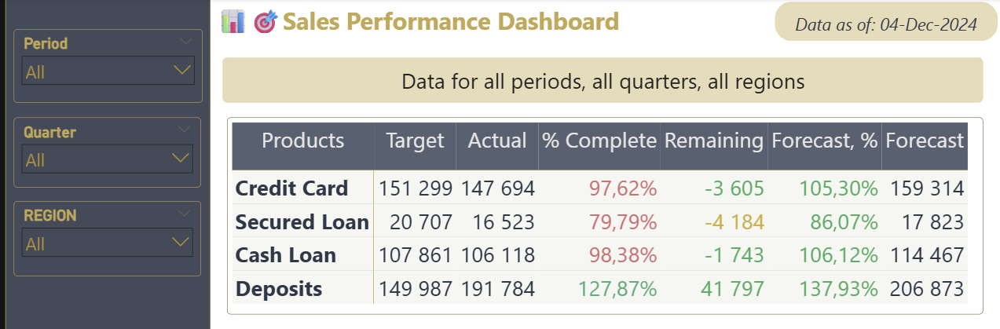
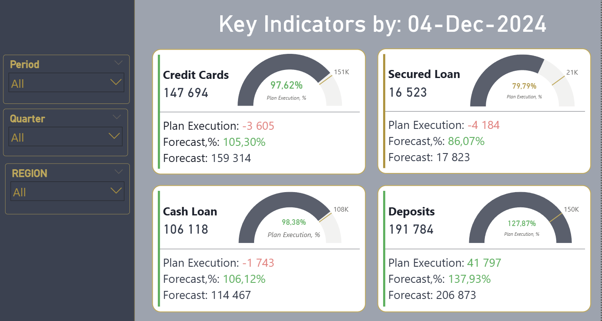
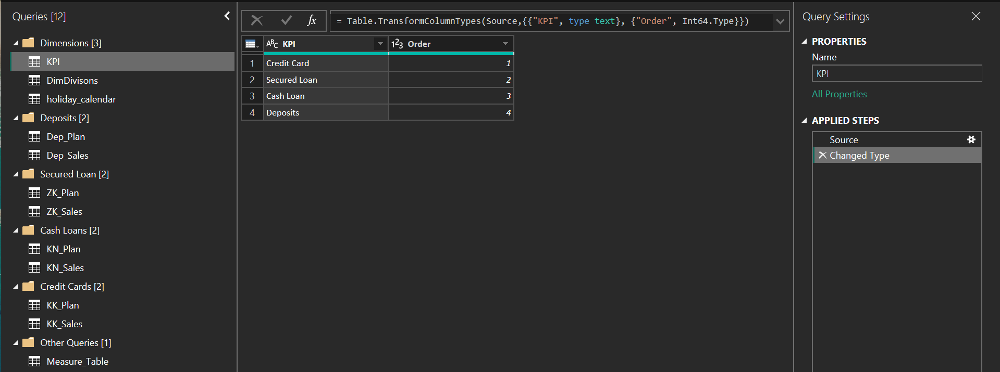
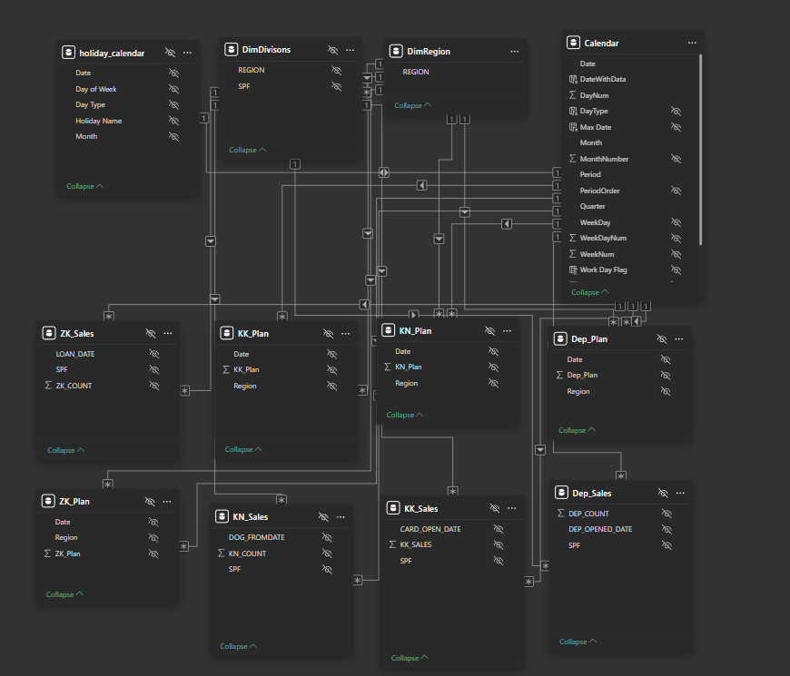
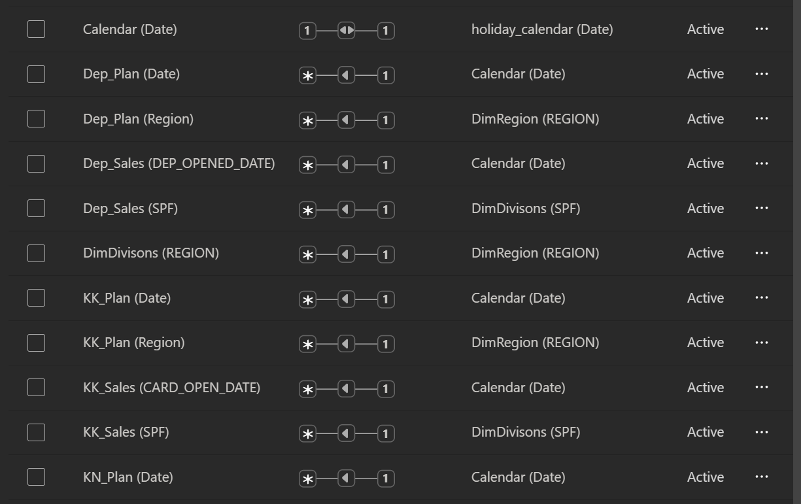
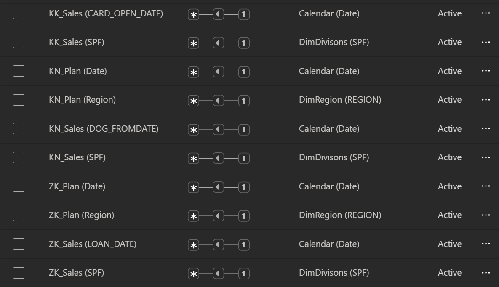

# 📈 Sales Performance Dashboard

Dashboard for tracking sales plan execution and forecasting year-end performance across key products, regions, and time periods.

**Stack:** `Power BI` `DAX` `Power Query` `Excel`

---

## 🗂️ Overview

**Pages:**
- **Sales Targets** — plan vs actual summary table across all products and regions
- **Target Performance** — KPI cards per product with gauge, plan execution, and forecast

**Filters (on every page):**
- Period (month)
- Quarter
- Region

**Header:**
- `Data as of: DD-Mon-YYYY` — date of the latest record in the dataset
- `Key Indicators by: DD-Mon-YYYY` — dynamic page title
- Dynamic filter label — shows active filter selections

---

## 📸 Screenshots

### Sales Targets


### Target Performance


### Power Query Structure


### Data Model — Diagram View


### Data Model — Relationships List (Part 1)


### Data Model — Relationships List (Part 2)


---

## 🔄 Power Query — Data Sources

All data is loaded from Excel files via Power Query. Queries are organized into groups:

**Products:**

| Code | Full Name |
|---|---|
| KK | Credit Card |
| ZK | Secured Loan |
| KN | Cash Loan |
| Dep | Deposits |

**Dimensions [3]:**

| Table | Description |
|---|---|
| `KPI` | Helper metric list for the matrix visual (Credit Card, Secured Loan, Cash Loan, Deposits) |
| `DimDivisons` | Source division reference table |
| `holiday_calendar` | Public holidays and working day calendar |

**Credit Cards [2]:** `KK_Plan`, `KK_Sales`

**Secured Loan [2]:** `ZK_Plan`, `ZK_Sales`

**Cash Loans [2]:** `KN_Plan`, `KN_Sales`

**Deposits [2]:** `Dep_Plan`, `Dep_Sales`

**Other Queries [1]:** `Measure_Table` — helper table for DAX measure organization

---

## 🔗 Relationships

All fact and plan tables are related to `Calendar` via date fields. Divisions and regions are connected through `DimDivisons` and `DimRegion` via the `SPF` and `REGION` keys. All relationships are active (many-to-one).

| From | Key | To |
|---|---|---|
| `Calendar` (Date) | 1—1 | `holiday_calendar` (Date) |
| `Dep_Plan` (Date) | `*`—1 | `Calendar` (Date) |
| `Dep_Plan` (Region) | `*`—1 | `DimRegion` (REGION) |
| `Dep_Sales` (DEP_OPENED_DATE) | `*`—1 | `Calendar` (Date) |
| `Dep_Sales` (SPF) | `*`—1 | `DimDivisons` (SPF) |
| `DimDivisons` (REGION) | `*`—1 | `DimRegion` (REGION) |
| `KK_Plan` (Date) | `*`—1 | `Calendar` (Date) |
| `KK_Plan` (Region) | `*`—1 | `DimRegion` (REGION) |
| `KK_Sales` (CARD_OPEN_DATE) | `*`—1 | `Calendar` (Date) |
| `KK_Sales` (SPF) | `*`—1 | `DimDivisons` (SPF) |
| `KN_Plan` (Date) | `*`—1 | `Calendar` (Date) |
| `KN_Plan` (Region) | `*`—1 | `DimRegion` (REGION) |
| `KN_Sales` (DOG_FROMDATE) | `*`—1 | `Calendar` (Date) |
| `KN_Sales` (SPF) | `*`—1 | `DimDivisons` (SPF) |
| `ZK_Plan` (Date) | `*`—1 | `Calendar` (Date) |
| `ZK_Plan` (Region) | `*`—1 | `DimRegion` (REGION) |
| `ZK_Sales` (LOAN_DATE) | `*`—1 | `Calendar` (Date) |
| `ZK_Sales` (SPF) | `*`—1 | `DimDivisons` (SPF) |

---

## 🗃️ Calculated Tables

```dax
DimRegion = SUMMARIZE(DimDivisons, DimDivisons[REGION])
```

> `DimRegion` is built using `SUMMARIZE` from `DimDivisons`, producing a deduplicated list of regions. Used as a dimension for the region filter and for relationships with plan tables.

---

## 🗃️ Calendar Table

```dax
Calendar =
ADDCOLUMNS(
    CALENDAR(DATE(2024, 1, 1), DATE(2024, 12, 31)),
    "Year",        YEAR([Date]),
    "Month",       FORMAT([Date], "mmm"),
    "MonthNumber", MONTH([Date]),
    "Period",      FORMAT([Date], "mmmyy"),
    "WeekDayNum",  WEEKDAY([Date], 2),
    "WeekDay",
        SWITCH(
            WEEKDAY([Date], 2),
            1, "Mon", 2, "Tue", 3, "Wed",
            4, "Thu", 5, "Fri", 6, "Sat", "Sun"
        ),
    "Quarter",     "q. " & FORMAT([Date], "q"),
    "DayNum",      FORMAT([Date], "D"),
    "WeekNum",     WEEKNUM([Date], 21),
    "PeriodOrder", FORMAT([Date], "YYYYMM")
)
```

**Calculated columns in Calendar:**

```dax
Max Date = MAX(KK_Sales[CARD_OPEN_DATE])
```
```dax
DateWithData = IF([Date] <= [Max Date], TRUE, FALSE)
```
```dax
DayType = RELATED(holiday_calendar[Day Type])
```
```dax
MaxDate = "Data as of: " & FORMAT(MAX(KK_Sales[CARD_OPEN_DATE]), "dd-mmm-yyyy")
```
```dax
Title = "Key Indicators by: " & FORMAT(MAX(KK_Sales[CARD_OPEN_DATE]), "dd-mmm-yyyy")
```
```dax
Work Day Flag =
IF(
    'Calendar'[DayType] = "Workday" && 'Calendar'[WeekDay] = "Sat", 0.25,
    IF('Calendar'[DayType] = "Workday", 1, 0)
)
```

> A Saturday declared as a working day counts as 0.25 of a working day.

---

## 📈 Measures

### 🗓️ Working Days

```dax
Work Days Count = SUM('Calendar'[Work Day Flag])
```
```dax
Work Days Passed =
VAR Yesterday = TODAY() - 1
RETURN
CALCULATE(
    [Work Days Count],
    FILTER(
        'Calendar',
        'Calendar'[Date] <= Yesterday &&
        'Calendar'[DateWithData] = TRUE()
    )
)
```
```dax
Remaining Work Days = [Work Days Count] - [Work Days Passed]
```

---

### 📦 KK — Credit Card

```dax
1. KK Plan = SUM(KK_Plan[KK_Plan])
```
```dax
2. KK Sales = SUM(KK_Sales[KK_SALES])
```
```dax
3. KK Plan Execution = [2. KK Sales] - [1. KK Plan]
```
```dax
4. KK Plan Execution, % = DIVIDE([2. KK Sales], [1. KK Plan], 0)
```
```dax
5. KK Sales Forecast, % =
IF(
    [Work Days Passed] = 0, BLANK(),
    [2. KK Sales] / [Work Days Passed] * ([Work Days Count] / [1. KK Plan])
)
```
```dax
6. KK Sales Forecast =
IF([5. KK Sales Forecast, %] = BLANK(), BLANK(), [1. KK Plan] * [5. KK Sales Forecast, %])
```
```dax
KK Plan MAX = SUM(KK_Plan[KK_Plan]) * 1.25
```

---

### 💳 ZK — Secured Loan

```dax
1. ZK Plan = SUM(ZK_Plan[ZK_Plan])
```
```dax
2. ZK Sales = SUM(ZK_Sales[ZK_COUNT])
```
```dax
3. ZK Plan Execution = [2. ZK Sales] - [1. ZK Plan]
```
```dax
4. ZK Plan Execution, % = DIVIDE([2. ZK Sales], [1. ZK Plan], 0)
```
```dax
5. ZK Sales Forecast, % =
IF([Work Days Passed] = 0, BLANK(),
    [2. ZK Sales] / [Work Days Passed] * ([Work Days Count] / [1. ZK Plan]))
```
```dax
6. ZK Sales Forecast =
IF([5. ZK Sales Forecast, %] = BLANK(), BLANK(), [1. ZK Plan] * [5. ZK Sales Forecast, %])
```
```dax
ZK Plan MAX = SUM(ZK_Plan[ZK_Plan]) * 1.25
```

---

### 🏠 KN — Cash Loan

```dax
1. KN Plan = SUM(KN_Plan[KN_Plan])
```
```dax
2. KN Sales = SUM(KN_Sales[KN_COUNT])
```
```dax
3. KN Plan Execution = [2. KN Sales] - [1. KN Plan]
```
```dax
4. KN Plan Execution, % = DIVIDE([2. KN Sales], [1. KN Plan], 0)
```
```dax
5. KN Sales Forecast, % =
IF([Work Days Passed] = 0, BLANK(),
    [2. KN Sales] / [Work Days Passed] * ([Work Days Count] / [1. KN Plan]))
```
```dax
6. KN Sales Forecast =
IF([5. KN Sales Forecast, %] = BLANK(), BLANK(), [1. KN Plan] * [5. KN Sales Forecast, %])
```
```dax
KN Plan MAX = SUM(KN_Plan[KN_Plan]) * 1.25
```

---

### 🏦 Dep — Deposits

```dax
1. Dep Plan = SUM(Dep_Plan[Dep_Plan])
```
```dax
2. Dep Sales = SUM(Dep_Sales[DEP_COUNT])
```
```dax
3. Dep Plan Execution = [2. Dep Sales] - [1. Dep Plan]
```
```dax
4. Dep Plan Execution, % = DIVIDE([2. Dep Sales], [1. Dep Plan], 0)
```
```dax
5. Dep Sales Forecast, % =
IF(
    [Work Days Passed] = 0, BLANK(),
    [2. Dep Sales] / [Work Days Passed] * ([Work Days Count] / [1. Dep Plan])
)
```
```dax
6. Dep Sales Forecast =
IF([5. Dep Sales Forecast, %] = BLANK(), BLANK(), [1. Dep Plan] * [5. Dep Sales Forecast, %])
```
```dax
Dep Plan Max = SUM(Dep_Plan[Dep_Plan]) * 1.25
```

---

### 🔀 KPI — Aggregated Measures (Matrix Visual)

Measures switch dynamically based on the `KPI[Order]` value via `SELECTEDVALUE`, allowing a single matrix visual to display all products simultaneously.

```dax
1. KPI Plan =
VAR A = SELECTEDVALUE('KPI'[Order])
RETURN
CALCULATE(
    SWITCH(A,
        1, [1. KK Plan],
        2, [1. ZK Plan],
        3, [1. KN Plan],
        4, [1. Dep Plan]
    ))
```
```dax
2. KPI Fact =
VAR A = SELECTEDVALUE('KPI'[Order])
RETURN
CALCULATE(
    SWITCH(A,
        1, [2. KK Sales],
        2, [2. ZK Sales],
        3, [2. KN Sales],
        4, [2. Dep Sales]
    ))
```
```dax
4. KPI Plan Execution =
VAR A = SELECTEDVALUE('KPI'[Order])
RETURN
CALCULATE(
    SWITCH(A,
        1, [3. KK Plan Execution],
        2, [3. ZK Plan Execution],
        3, [3. KN Plan Execution],
        4, [3. Dep Plan Execution]
    ))
```
```dax
5. KPI Plan Execution, % =
VAR A = SELECTEDVALUE('KPI'[Order])
RETURN
CALCULATE(
    SWITCH(A,
        1, [4. KK Plan Execution, %],
        2, [4. ZK Plan Execution, %],
        3, [4. KN Plan Execution, %],
        4, [4. Dep Plan Execution, %]
    ))
```
```dax
6. KPI Forecast, % =
VAR A = SELECTEDVALUE('KPI'[Order])
RETURN
CALCULATE(
    SWITCH(A,
        1, [5. KK Sales Forecast, %],
        2, [5. ZK Sales Forecast, %],
        3, [5. KN Sales Forecast, %],
        4, [5. Dep Sales Forecast, %]
    ))
```
```dax
7. KPI Forecast =
VAR A = SELECTEDVALUE('KPI'[Order])
RETURN
CALCULATE(
    SWITCH(A,
        1, [6. KK Sales Forecast],
        2, [6. ZK Sales Forecast],
        3, [6. KN Sales Forecast],
        4, [6. Dep Sales Forecast]
    ))
```

---

### 🎨 Conditional Formatting (Color)

```dax
KPI Plan Execution Colour FX =
VAR PlEx = [4. KPI Plan Execution]
RETURN
IF(
    NOT(ISBLANK(PlEx)),
    IF(PlEx < 0, "#DE6A73", "#35AE78"),
    "#000000"
)
```

> Negative deviation from plan — red `#DE6A73`; positive — green `#35AE78`.

```dax
KPI Plan Execution Colour, % FX =
VAR PlEx = [5. KPI Plan Execution, %]
RETURN
IF(
    NOT(ISBLANK(PlEx)),
    IF(PlEx < 0.5, "#DE6A73",
        IF(PlEx < 0.8, "#D4AF37", "#27AE60")),
    "#000000"
)
```
```dax
KPI Forecast Colour, % =
VAR PlEx = [6. KPI Forecast, %]
RETURN
IF(
    NOT(ISBLANK(PlEx)),
    IF(PlEx < 0.5, "#DE6A73",
        IF(PlEx < 0.8, "#D4AF37", "#27AE60")),
    "#000000"
)
```

> Color logic: 🔴 below 50% · 🟡 50–80% · 🟢 above 80%

---

### 🏷️ Dynamic Labels

```dax
FilterLabelCombined =
VAR SelectedPeriod  = SELECTEDVALUE('Calendar'[Period],  "All months")
VAR SelectedQuarter = SELECTEDVALUE('Calendar'[Quarter], "All quarters")
VAR SelectedRegion  = SELECTEDVALUE('DimRegion'[Region], "All regions")
RETURN
IF(
    SelectedPeriod = "All months" && SelectedQuarter = "All quarters" && SelectedRegion = "All regions",
    "Data for all periods, all quarters, all regions",
    "Data by: " &
    IF(SelectedPeriod  <> "All months",   SelectedPeriod,  "all months")   & ", " &
    IF(SelectedQuarter <> "All quarters", SelectedQuarter, "all quarters") & ", " &
    IF(SelectedRegion  <> "All regions",  SelectedRegion,  "all regions")
)
```

> Dynamically reflects active filters. If nothing is selected, displays "all periods, all quarters, all regions".

---

## 🛠️ Tech Stack

| Tool | Usage |
|---|---|
| Power BI Desktop | Report building, data model |
| Power Query (M) | Data load, type casting |
| DAX | Calendar, calculated columns, measures, color FX |
| Excel | Source data files (plan + sales per product) |
