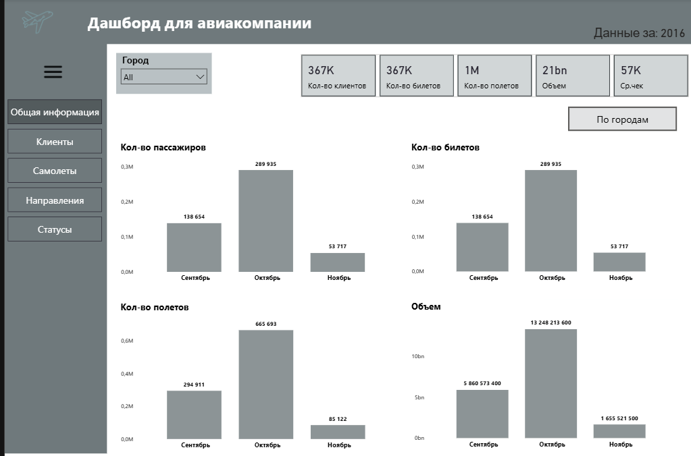
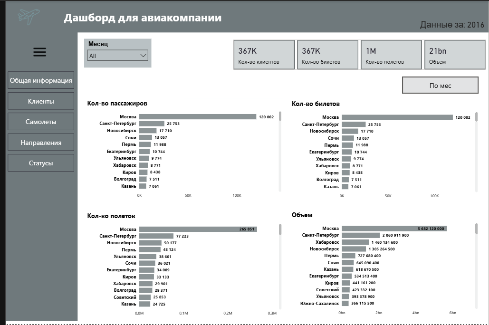
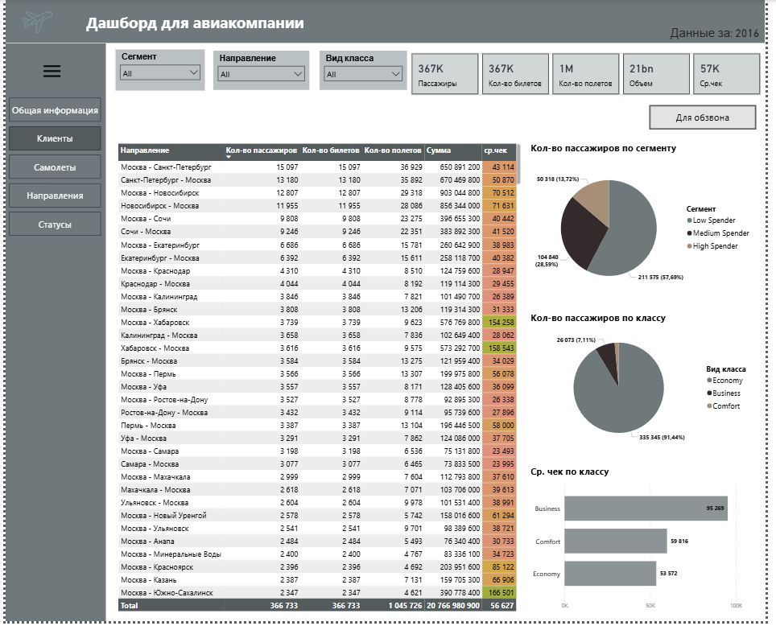
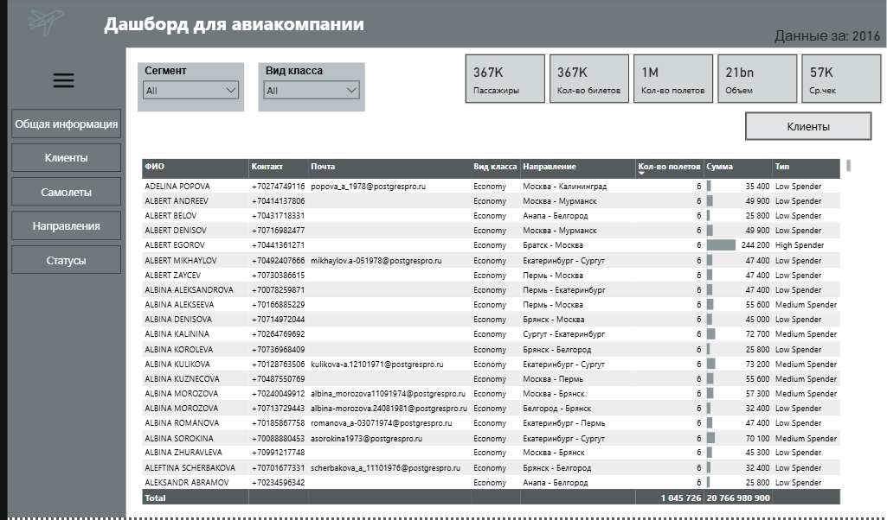
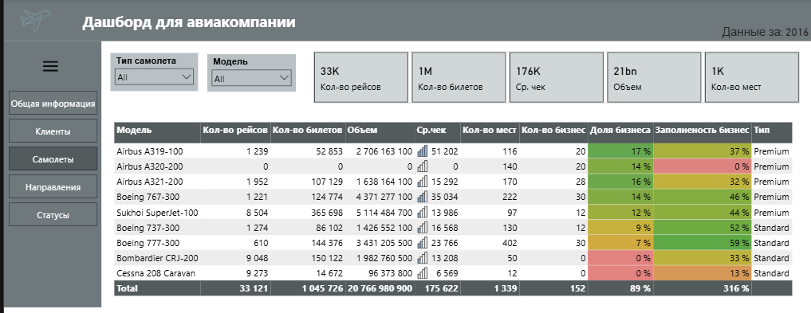
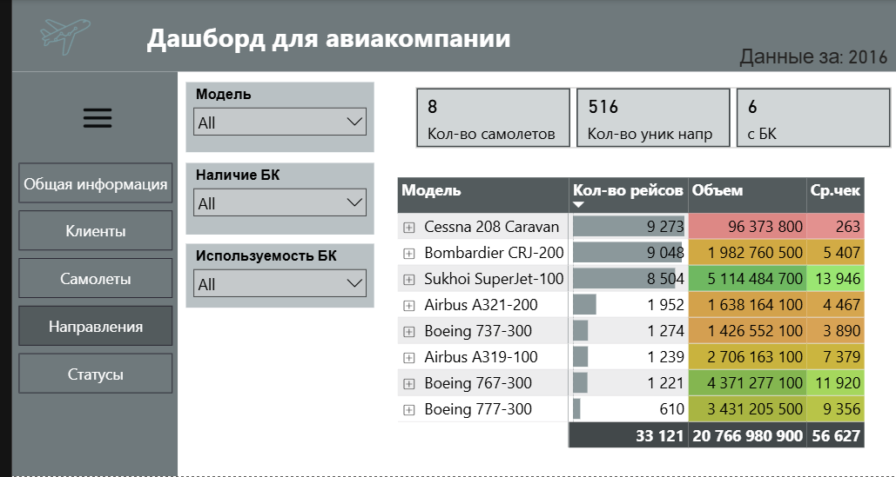
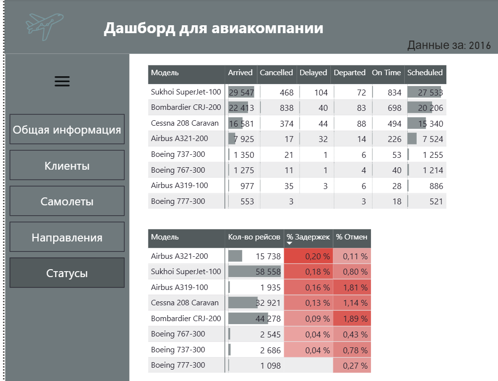
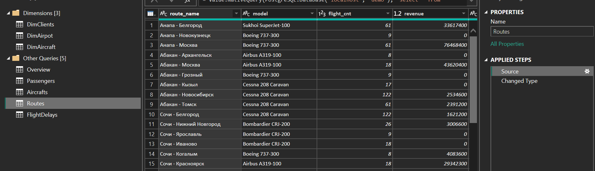
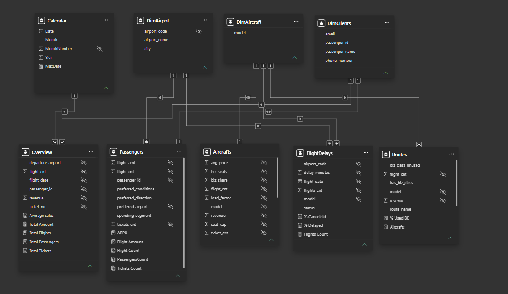
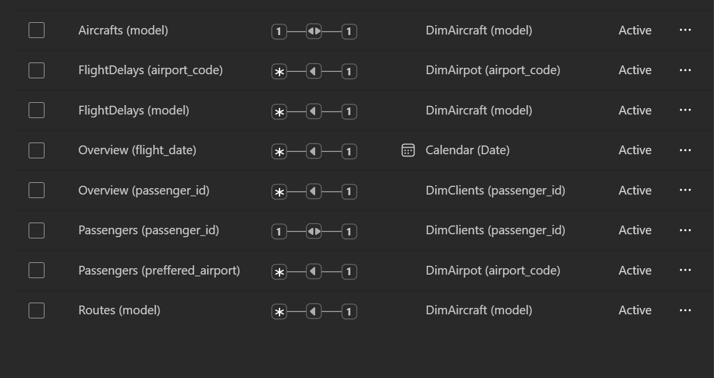

# ✈️ Airline Analytics Dashboard

> **Учебный проект** в рамках курса [Product Masters: Data Analyst](https://yerkesalmurza.github.io/portfolio/#)

Комплексная панель мониторинга авиакомпании на основе открытой базы данных PostgreSQL (`bookings`).
Дашборд охватывает 5 аналитических страниц: общую информацию, клиентов, самолёты, направления и статусы рейсов.

📊 **[Live Dashboard →](https://app.powerbi.com/view?r=eyJrIjoiNGNjNTI2ZTItOWYwNS00YzRmLWEyODktODY0MzA2ZjdmNTMyIiwidCI6ImRjY2FmMmM3LWI2NjgtNGIwZS1hMzg0LWYyNGY1MTQyMzNiYiJ9)**

---

## 📋 Business Objective

Заказчик — авиакомпания, которой необходим единый инструмент для мониторинга операционных и коммерческих показателей.

**Ключевые задачи:**
- Отслеживать развитие компании в динамике (рейсы, пассажиры, выручка)
- Понимать клиентский профиль и предпочтения по направлениям
- Оценивать эффективность использования воздушного парка (загрузка, бизнес-класс)
- Выявлять самые прибыльные и востребованные маршруты
- Находить направления с незадействованными бизнес-местами для оптимизации флота
- Формировать базу клиентов для обзвона с гибкой фильтрацией

---

## 📸 Dashboard Pages

### Navigation
Главное меню с описанием всех страниц дашборда.

### 1. Общая информация
Ключевые метрики компании: количество рейсов, билетов, пассажиров и объём выручки.
Динамика по месяцам и городам. Фильтр по месяцу.




### 2. Клиенты
Анализ клиентской базы по направлениям, сегментам трат (Low / Medium / High Spender) и классу обслуживания.
Страница содержит таблицу с контактами (ФИО, телефон, email) — готова к выгрузке для обзвона.
Фильтры: сегмент, вид класса, направление.




### 3. Самолёты
Рейтинг воздушных судов по количеству рейсов, выручке и загрузке.
Цветовая индикация заполненности бизнес-класса. Фильтр "Премиальные самолёты" — модели с долей бизнес-мест выше средней.



### 4. Направления
Топ маршрутов по пассажиропотоку и выручке (тотал и на 1 клиента).
Выявление направлений с бизнес-классом в самолёте, но нулевым спросом на него — кандидаты на замену флота.



### 5. Статусы рейсов
Таблица статусов по моделям самолётов: Arrived, Cancelled, Delayed, On Time.
Процент задержек и отмен с цветовой индикацией.



---

## 🗄️ Data Architecture: Materialized Views

Данные загружаются **напрямую из PostgreSQL через Power Query** — без промежуточных файлов.
Для каждой аналитической области создана отдельная материализованная вьюха.

| Файл | Описание |
|------|----------|
| `SQL/aircrafts_mv.sql` | Статистика по самолётам: количество мест, доля бизнес-класса, загрузка, выручка |
| `SQL/passengers_mv.sql` | Пассажиры: предпочитаемые направления, класс, сегмент трат, ARPU |
| `SQL/overview_mv.sql` | Общая сводка: рейсы, билеты, выручка по датам и аэропортам |
| `SQL/routes_mv.sql` | Маршруты: выручка, рейсы, наличие и использование бизнес-класса |
| `SQL/flightdelays_mv.sql` | Статусы рейсов: задержки и отмены по моделям и аэропортам |
| `SQL/dimclients.sql` | Справочник клиентов: ФИО, телефон, email |

**Почему материализованные вью, а не прямые запросы:**
исходные таблицы `bookings` содержат миллионы строк. Мат. вью агрегируют данные на уровне БД — Power BI получает уже готовые, лёгкие таблицы без тяжёлых JOIN-ов при каждом обновлении.

---

### `aircrafts_mv` — Самолёты

Агрегирует по каждой модели: вместимость, долю бизнес-класса, количество рейсов, выручку, средний чек и загрузку.
Автоматически присваивает тип `Premium` / `Standard` — сравнивая долю бизнес-мест самолёта со средней по всему парку.

```sql
CREATE MATERIALIZED VIEW bookings.aircrafts_mv AS
WITH seat_stats AS (
    SELECT
        aircraft_code,
        COUNT(*)                                                        AS seat_cap,
        SUM(CASE WHEN fare_conditions = 'Business' THEN 1 ELSE 0 END)  AS biz_seats
    FROM bookings.seats
    GROUP BY aircraft_code
),
avg_biz_ratio AS (
    SELECT AVG(biz_seats::numeric / NULLIF(seat_cap, 0)::numeric) AS avg_ratio
    FROM seat_stats
),
flight_stats AS (
    SELECT aircraft_code, COUNT(*) AS flight_cnt
    FROM bookings.flights
    GROUP BY aircraft_code
),
ticket_stats AS (
    SELECT
        f.aircraft_code,
        COUNT(tf.ticket_no)  AS ticket_cnt,
        SUM(tf.amount)       AS revenue,
        AVG(tf.amount)       AS avg_price
    FROM bookings.flights f
    JOIN bookings.ticket_flights tf ON f.flight_id = tf.flight_id
    GROUP BY f.aircraft_code
)
SELECT
    a.model,
    COALESCE(s.seat_cap,    0)  AS seat_cap,
    COALESCE(s.biz_seats,   0)  AS biz_seats,
    ROUND(COALESCE(s.biz_seats::numeric / NULLIF(s.seat_cap, 0), 0), 2) AS biz_share,
    COALESCE(f.flight_cnt,  0)  AS flight_cnt,
    COALESCE(t.ticket_cnt,  0)  AS ticket_cnt,
    COALESCE(t.revenue,     0)  AS revenue,
    COALESCE(t.avg_price,   0)  AS avg_price,
    CASE
        WHEN f.flight_cnt IS NULL OR s.seat_cap = 0 THEN 0
        ELSE ROUND(t.ticket_cnt::numeric / (f.flight_cnt * s.seat_cap)::numeric, 2)
    END AS load_factor,
    CASE
        WHEN s.seat_cap = 0 THEN 'Standard'
        WHEN (s.biz_seats::numeric / s.seat_cap::numeric) > avg.avg_ratio THEN 'Premium'
        ELSE 'Standard'
    END AS type
FROM bookings.aircrafts a
LEFT JOIN seat_stats      s   ON a.aircraft_code = s.aircraft_code
LEFT JOIN flight_stats    f   ON a.aircraft_code = f.aircraft_code
LEFT JOIN ticket_stats    t   ON a.aircraft_code = t.aircraft_code
LEFT JOIN avg_biz_ratio   avg ON TRUE
WITH DATA;
```

---

### `dimclients` — Справочник клиентов

Уникальные пассажиры с контактными данными, извлечёнными из JSONB-поля `contact_data`.

```sql
CREATE MATERIALIZED VIEW bookings.dimclients AS
SELECT
    passenger_id,
    passenger_name,
    contact_data ->> 'phone' AS phone_number,
    contact_data ->> 'email' AS email
FROM bookings.tickets
GROUP BY passenger_id, passenger_name, contact_data
WITH DATA;
```

---

### `overview_mv` — Общая информация

Агрегирует данные по рейсам, билетам и выручке с группировкой по месяцу и аэропорту вылета.
Используется для KPI-карточек и динамики на главной странице.

```sql
CREATE MATERIALIZED VIEW bookings.overview_mv AS
SELECT
    DATE_TRUNC('month', f.scheduled_departure)::date  AS flight_date,
    f.departure_airport,
    t.passenger_id,
    tf.ticket_no,
    tf.amount                                          AS revenue,
    COUNT(DISTINCT tf.flight_id)                       AS flight_cnt
FROM bookings.flights f
LEFT JOIN bookings.ticket_flights tf ON f.flight_id  = tf.flight_id
LEFT JOIN bookings.tickets t         ON tf.ticket_no = t.ticket_no
GROUP BY
    DATE_TRUNC('month', f.scheduled_departure)::date,
    f.departure_airport,
    t.passenger_id,
    tf.ticket_no,
    tf.amount
WITH DATA;
```

---

### `passengers_mv` — Клиенты

Профиль каждого пассажира: предпочитаемые направление, класс и аэропорт — определяются через `ROW_NUMBER()` по частоте.
Сегментация по тратам: `High Spender` (≥ 100K), `Medium Spender` (≥ 50K), `Low Spender`.

```sql
CREATE MATERIALIZED VIEW bookings.passengers_mv AS
WITH passengers AS (
    SELECT
        t.passenger_id,
        COUNT(DISTINCT tf.ticket_no)  AS tickets_cnt,
        COUNT(DISTINCT tf.flight_id)  AS flight_cnt,
        SUM(tf.amount)                AS flight_amt
    FROM bookings.tickets t
    JOIN bookings.ticket_flights tf ON tf.ticket_no = t.ticket_no
    GROUP BY t.passenger_id
),
preferred_direction AS (
    SELECT r.passenger_id,
           CONCAT(dep.city, ' - ', arr.city) AS preferred_direction
    FROM (
        SELECT t.passenger_id,
               f.departure_airport, f.arrival_airport,
               COUNT(*) AS route_cnt,
               ROW_NUMBER() OVER (PARTITION BY t.passenger_id ORDER BY COUNT(*) DESC) AS rn
        FROM bookings.tickets t
        JOIN bookings.ticket_flights tf ON tf.ticket_no = t.ticket_no
        JOIN bookings.flights f         ON f.flight_id  = tf.flight_id
        GROUP BY t.passenger_id, f.departure_airport, f.arrival_airport
    ) r
    JOIN bookings.airports dep ON r.departure_airport = dep.airport_code
    JOIN bookings.airports arr ON r.arrival_airport   = arr.airport_code
    WHERE r.rn = 1
),
preferred_conditions AS (
    SELECT e.passenger_id, e.fare_conditions AS preferred_conditions
    FROM (
        SELECT t.passenger_id, tf.fare_conditions,
               COUNT(*) AS conditions_count,
               ROW_NUMBER() OVER (PARTITION BY t.passenger_id ORDER BY COUNT(*) DESC) AS rn
        FROM bookings.tickets t
        JOIN bookings.ticket_flights tf ON t.ticket_no = tf.ticket_no
        GROUP BY t.passenger_id, tf.fare_conditions
    ) e
    WHERE e.rn = 1
),
preferred_airport AS (
    SELECT c.passenger_id, c.airport_code AS preffered_airport
    FROM (
        SELECT t.passenger_id, a.airport_code,
               COUNT(*) AS flight_count,
               ROW_NUMBER() OVER (PARTITION BY t.passenger_id ORDER BY COUNT(*) DESC) AS rn
        FROM bookings.tickets t
        JOIN bookings.ticket_flights tf ON t.ticket_no       = tf.ticket_no
        JOIN bookings.flights f         ON tf.flight_id      = f.flight_id
        JOIN bookings.airports a        ON f.departure_airport = a.airport_code
        GROUP BY t.passenger_id, a.airport_code
    ) c
    WHERE c.rn = 1
)
SELECT
    p.passenger_id,
    pd.preferred_direction,
    pc.preferred_conditions,
    pa.preffered_airport,
    p.tickets_cnt,
    p.flight_cnt,
    p.flight_amt,
    CASE
        WHEN p.flight_amt >= 100000 THEN 'High Spender'
        WHEN p.flight_amt >= 50000  THEN 'Medium Spender'
        ELSE                             'Low Spender'
    END AS spending_segment
FROM passengers p
LEFT JOIN preferred_direction  pd ON pd.passenger_id = p.passenger_id
LEFT JOIN preferred_conditions pc ON pc.passenger_id = p.passenger_id
LEFT JOIN preferred_airport    pa ON pa.passenger_id = p.passenger_id
WITH DATA;
```

---

### `flightdelays_mv` — Статусы рейсов

Задержки и статусы по каждому рейсу с подсчётом количества рейсов через оконную функцию.

```sql
CREATE MATERIALIZED VIEW bookings.flightdelays_mv AS
SELECT
    f.scheduled_departure::date                                              AS flight_date,
    f.departure_airport                                                      AS airport_code,
    a.model,
    f.status,
    ROUND(EXTRACT(EPOCH FROM f.actual_arrival - f.scheduled_arrival) / 60.0) AS delay_minutes,
    COUNT(*) OVER (
        PARTITION BY f.scheduled_departure::date, f.departure_airport, a.model
    )                                                                        AS flights_cnt
FROM bookings.flights f
LEFT JOIN bookings.aircrafts a ON f.aircraft_code = a.aircraft_code
WITH DATA;
```

---

### `routes_mv` — Направления

Маршруты по парам городов с выручкой, количеством рейсов и ключевым флагом: есть ли бизнес-класс на борту и используется ли он пассажирами.
Именно этот флаг (`biz_class_unused`) позволяет выявить направления-кандидаты на замену флота.

```sql
CREATE MATERIALIZED VIEW bookings.routes_mv AS
WITH seat_stats AS (
    SELECT
        aircraft_code,
        SUM(CASE WHEN LOWER(fare_conditions) = 'business' THEN 1 ELSE 0 END) AS biz_seats
    FROM bookings.seats
    GROUP BY aircraft_code
),
flights_base AS (
    SELECT
        f.flight_id, f.departure_airport, f.arrival_airport,
        f.aircraft_code, a.model, s.biz_seats
    FROM bookings.flights f
    LEFT JOIN seat_stats       s ON f.aircraft_code = s.aircraft_code
    LEFT JOIN bookings.aircrafts a ON f.aircraft_code = a.aircraft_code
),
flights_agg AS (
    SELECT
        departure_airport, arrival_airport, model,
        COUNT(DISTINCT flight_id)                                        AS flight_cnt,
        SUM(CASE WHEN biz_seats > 0 THEN 1 ELSE 0 END)                  AS flights_with_biz,
        MAX(biz_seats)                                                   AS has_biz_class_flag
    FROM flights_base
    GROUP BY departure_airport, arrival_airport, model
),
revenue_agg AS (
    SELECT
        f.departure_airport, f.arrival_airport, a.model,
        SUM(tf.amount)                                                   AS revenue,
        COUNT(DISTINCT tf.ticket_no)                                     AS ticket_cnt,
        COUNT(DISTINCT t.passenger_id)                                   AS passenger_cnt,
        SUM(CASE WHEN LOWER(tf.fare_conditions) = 'business'
                  AND tf.amount > 0 THEN 1 ELSE 0 END)                  AS biz_sold
    FROM bookings.flights f
    JOIN bookings.ticket_flights tf ON f.flight_id  = tf.flight_id
    JOIN bookings.tickets t         ON tf.ticket_no = t.ticket_no
    LEFT JOIN bookings.aircrafts a  ON f.aircraft_code = a.aircraft_code
    GROUP BY f.departure_airport, f.arrival_airport, a.model
),
airports AS (
    SELECT airport_code, city FROM bookings.airports
)
SELECT
    CONCAT(dep.city, ' - ', arr.city)  AS route_name,
    fa.model,
    COALESCE(fa.flight_cnt, 0)         AS flight_cnt,
    COALESCE(ra.revenue, 0)            AS revenue,
    CASE WHEN fa.has_biz_class_flag > 0 THEN 'Да' ELSE 'Нет' END        AS has_biz_class,
    CASE
        WHEN COALESCE(ra.biz_sold, 0) = 0
         AND COALESCE(fa.flights_with_biz, 0) > 0 THEN 'Не используется'
        ELSE 'Используются'
    END                                                                  AS biz_class_unused
FROM flights_agg fa
LEFT JOIN revenue_agg ra  ON fa.departure_airport = ra.departure_airport
                          AND fa.arrival_airport  = ra.arrival_airport
                          AND fa.model            = ra.model
LEFT JOIN airports dep    ON fa.departure_airport = dep.airport_code
LEFT JOIN airports arr    ON fa.arrival_airport   = arr.airport_code
WITH DATA;
```

---

## ⚙️ ETL: Power Query

Подключение напрямую к PostgreSQL через `Value.NativeQuery`.
В Power Query применены только базовые шаги: `Source` + `Changed Type`.
Вся трансформация и агрегация выполнена на стороне БД в материализованных вьюхах.

**Структура запросов:**

- **Dimensions (3):** `DimClients`, `DimAirport`, `DimAircraft`
- **Fact / Aggregated (5):** `Overview`, `Passengers`, `Aircrafts`, `Routes`, `FlightDelays`



---

## 🔗 Data Model

Star schema: 3 справочника + 5 агрегированных таблиц + Calendar.



| From | Relationship | To |
|------|-------------|-----|
| Overview (flight_date) | * → 1 | Calendar (Date) |
| Overview (passenger_id) | * → 1 | DimClients (passenger_id) |
| Passengers (passenger_id) | 1 ↔ 1 | DimClients (passenger_id) |
| Passengers (preffered_airport) | * → 1 | DimAirport (airport_code) |
| Aircrafts (model) | 1 ↔ 1 | DimAircraft (model) |
| FlightDelays (airport_code) | * → 1 | DimAirport (airport_code) |
| FlightDelays (model) | * → 1 | DimAircraft (model) |
| Routes (model) | * → 1 | DimAircraft (model) |



---

## 📐 DAX Measures

### Calendar Table
```dax
Calendar = 
ADDCOLUMNS(
    CALENDAR(
        MIN(Overview[flight_date]),
        MAX(Overview[flight_date])
    ),
    "Year", YEAR([Date]),
    "Month", FORMAT([Date], "mmmm", "ru-ru"),
    "MonthNumber", MONTH([Date])
)
```

---

### Overview — Общие показатели
```dax
Total Flights = SUM(Overview[flight_cnt])
Total Tickets = DISTINCTCOUNT(Overview[ticket_no])
Total Passengers = DISTINCTCOUNT(Overview[passenger_id])
Total Amount = SUM(Overview[revenue])
Average Sales = DIVIDE([Total Amount], [Total Passengers], 0)
```

---

### Aircrafts — Самолёты
```dax
Flight_Count    = SUM(Aircrafts[flight_cnt])
Seats Count     = SUM(Aircrafts[seat_cap])
Bussiness Seats = SUM(Aircrafts[biz_seats])
Bussiness Share = SUM(Aircrafts[biz_share])
Load %          = SUM(Aircrafts[load_factor])
TicketsCount    = SUM(Aircrafts[ticket_cnt])
Amount          = SUM(Aircrafts[revenue])
AVG Price       = SUM(Aircrafts[avg_price])
```

---

### Passengers — Клиенты
```dax
PassengersCount = DISTINCTCOUNT(Passengers[passenger_id])
Tickets Count   = SUM(Passengers[tickets_cnt])
Flight Count    = SUM(Passengers[flight_cnt])
Flight Amount   = SUM(Passengers[flight_amt])
ARPU            = DIVIDE([Flight Amount], [PassengersCount])
```

---

### Routes — Направления
```dax
Flights             = SUM(Routes[flight_cnt])
TicketAmount        = SUM(Routes[revenue])
Aircrafts           = DISTINCTCOUNT(Routes[model])
Aircrafts with BK   = CALCULATE([Aircrafts], FILTER(Routes, Routes[has_biz_class] = "Да"))

-- Направления, где бизнес-класс есть, но не используется
Used BK = 
CALCULATE(
    [Flights],
    FILTER(
        Routes,
        Routes[biz_class_unused] = "Используются" &&
        Routes[has_biz_class] = "Да"
    )
)
% Used BK = DIVIDE([Used BK], [Flights])
```

---

### FlightDelays — Статусы рейсов
```dax
Flights Count = SUM(FlightDelays[flights_cnt])

% Delayed = DIVIDE(
    CALCULATE([Flights Count], FlightDelays[status] = "Delayed"),
    SUM(FlightDelays[flights_cnt])
)

% Canceleld = DIVIDE(
    CALCULATE([Flights Count], FlightDelays[status] = "Cancelled"),
    SUM(FlightDelays[flights_cnt])
)
```

---

## 🛠️ Stack

| Инструмент | Применение |
|-----------|-----------|
| Power BI Desktop | Разработка дашборда, DAX, визуализация |
| DAX | Меры, вычисляемые таблицы |
| Power Query | Подключение к PostgreSQL, типизация |
| PostgreSQL | Исходная БД `bookings`, материализованные вьюхи |
| SQL | Создание мат. вью, агрегация на стороне БД |
