# 📊 KPI Sales Tracker Dashboard

## 📋 Business Objective
The main objective of this dashboard is to **track sales plan execution** across regions and months, and to **forecast the final year-end performance** based on actual results and working days passed.

---

## 📸 Dashboard Pages

Navigation menu allows users to easily switch between analytical views:

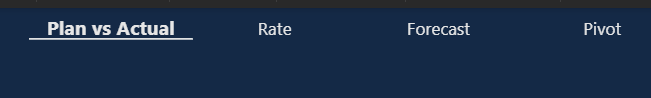

### 1. Plan vs Actual
Comparison of planned vs actual KPI values by region (top chart) and by month (bottom chart).
Tooltips enabled. Edit interactions activated — visuals dynamically respond to slicer selections.
Interactive filters: Month, Region.

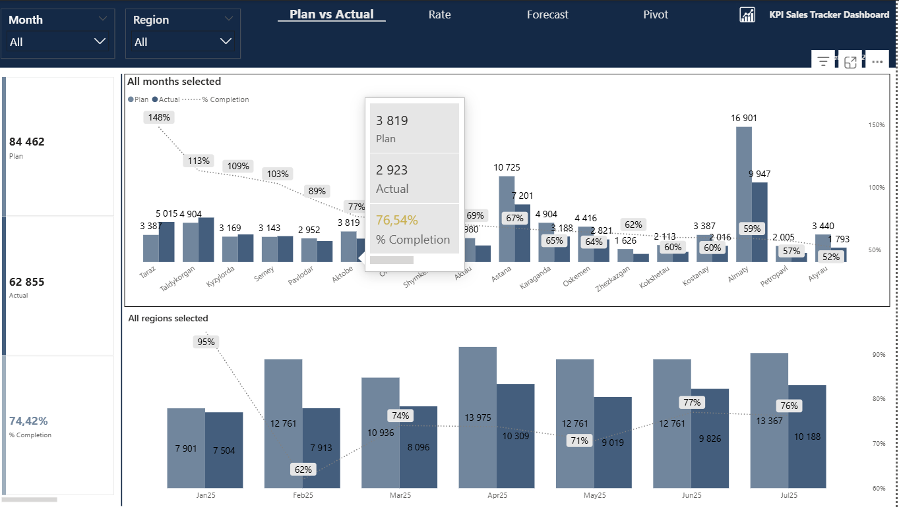

### 2. Rate
KPI rate breakdown by region.
Top 3 regions highlighted in blue, bottom 2 in red.
Tooltips enabled. Edit interactions enabled. Responsive to Month and Region filters.

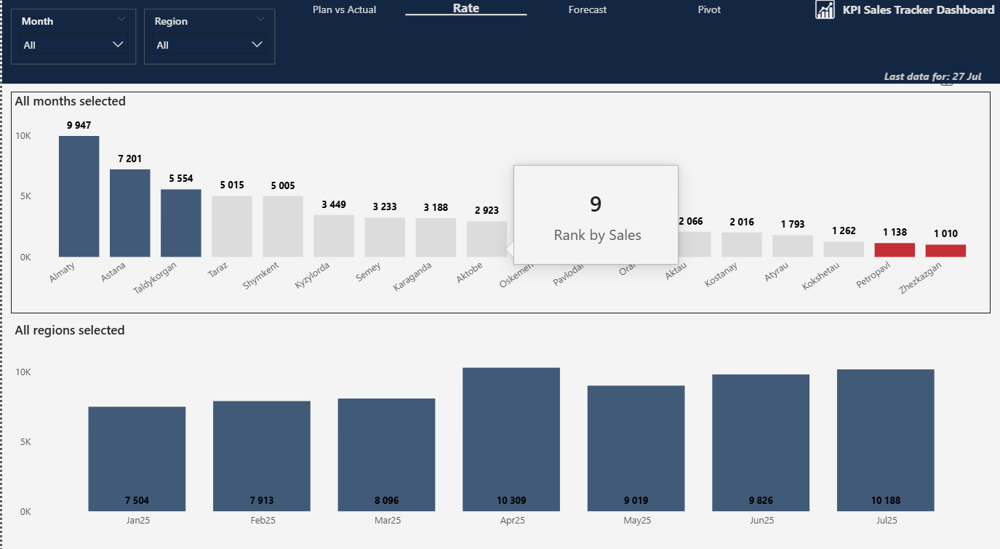

### 3. Forecast
Displays forecasted KPI values alongside actuals.
Forecast logic visualized per period. Bottom 3 underperforming regions highlighted.
Tooltips enabled.

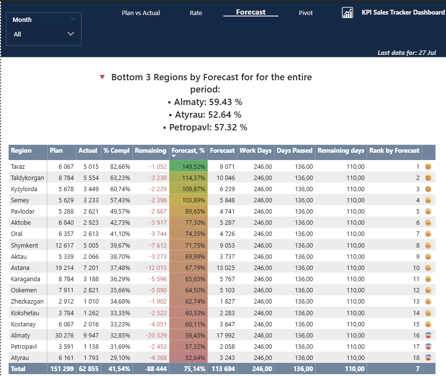

### 4. Pivot
Detailed KPI pivot table — pure data view. No visual charts.
Supports full filtering by Month and Region.
Edit interactions activated — visuals dynamically respond to slicer selections.

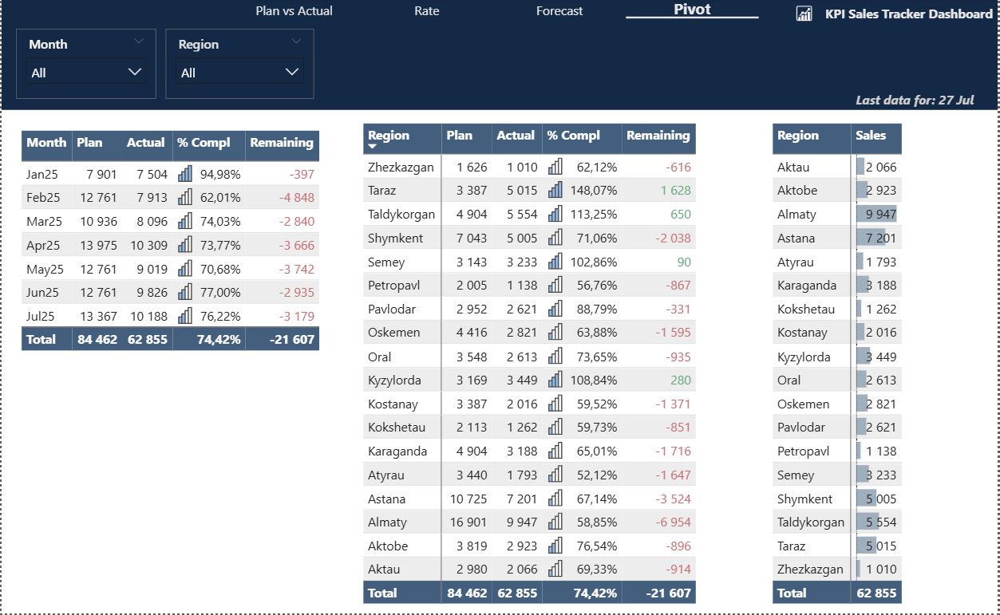

---

## ⚙️ ETL: Data Load and Transformation in Power Query

All data sources are in Excel format — this is a sample dataset.

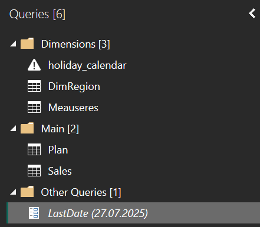

**Dimension tables:**
- `holiday_calendar` — used for forecast calculations. It helps to exclude public holidays and weekends from the working days
- `DimRegion` — used to link plan and actual data, and also used in filters

**Fact tables:**
- `Plan` — contains planned values for 2025 by region and date
- `Sales` — contains actual sales data for 2025

There were only a few transformations applied in Power Query. Only the **Plan** table was transformed using the **Unpivot Other Columns** function to convert monthly columns into rows with a unified "Date" and "Plan" structure.

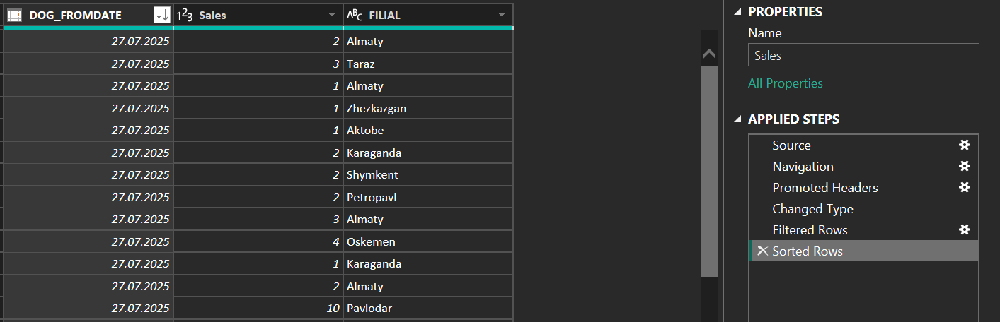

Additionally, column data types were set to the appropriate formats —
**Date** columns were converted to date format, and **Plan** values were set to numeric format.

---

## 🔗 Relationships

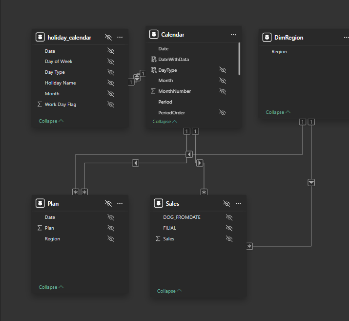
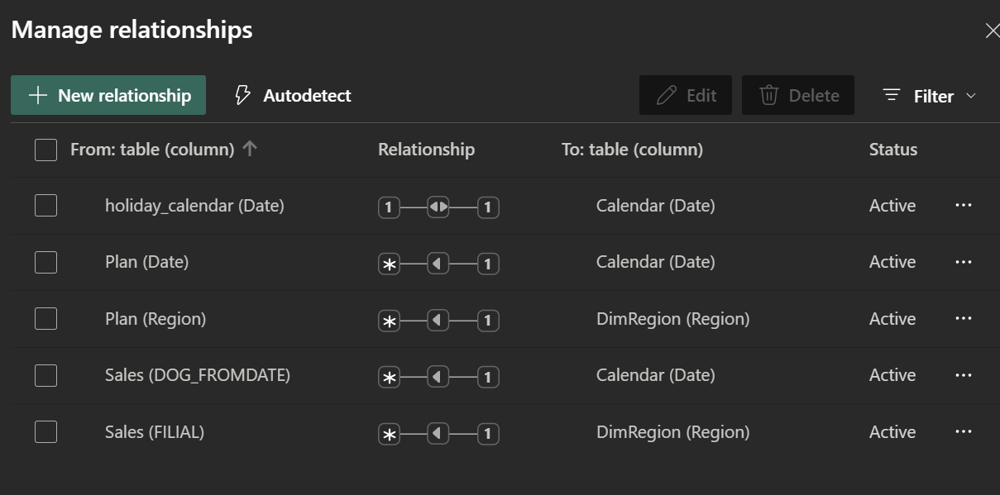

| From | Relationship | To |
|------|-------------|-----|
| holiday_calendar (Date) | 1 — 1 | Calendar (Date) |
| Plan (Date) | * — 1 | Calendar (Date) |
| Plan (Region) | * — 1 | DimRegion (Region) |
| Sales (DOG_FROMDATE) | * — 1 | Calendar (Date) |
| Sales (FILIAL) | * — 1 | DimRegion (Region) |

These relationships ensure proper filtering and aggregation across fact tables and dimensions.
Each connection helps maintain data integrity and enables correct visuals in the report.
This structure also allows users to use regional and time-based filters effectively.

---

## 📐 DAX Measures

### Calendar Table

A Calendar table was created, which takes the **minimum** and **maximum** dates from the Sales table:
```dax
Calendar = ADDCOLUMNS(
    CALENDAR(
        DATE(YEAR(MIN(MIN(Sales[DOG_FROMDATE]), MIN(Plan[Date]))), 1, 1),
        DATE(YEAR(MAX(MAX(Sales[DOG_FROMDATE]), MAX(Plan[Date]))), 12, 31)
    ),
    "Year", YEAR([Date]),
    "Month", FORMAT([Date], "mmm", "ru-ru"),
    "MonthNumber", MONTH([Date]),
    "Period", FORMAT([Date], "mmmyy", "ru-ru"),
    "WeekDayNum", WEEKDAY([Date], 2),
    "WeekDay",
        IF(WEEKDAY([Date], 2) = 1, "Mon",
        IF(WEEKDAY([Date], 2) = 2, "Tue",
        IF(WEEKDAY([Date], 2) = 3, "Wed",
        IF(WEEKDAY([Date], 2) = 4, "Thu",
        IF(WEEKDAY([Date], 2) = 5, "Fri",
        IF(WEEKDAY([Date], 2) = 6, "Sat", "Sun")))))),
    "Quarter", "кв. " & FORMAT([Date], "q"),
    "PeriodOrder", FORMAT([Date], "YYYYMM")
)
```

**DateWithData** — a calculated column that returns `TRUE` if the date is less than or equal to the max available date. Used as a **page-level filter** to exclude future dates from the visuals:
```dax
DateWithData =
'Calendar'[Date] <= MAX(Sales[DOG_FROMDATE])
```

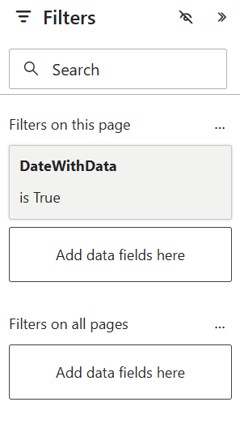

**DayType** — brings the day type (e.g., Workday, Weekend, Holiday) from the holiday calendar:
```dax
DayType = RELATED(holiday_calendar[Day Type])
```

**Virtual Table for Ranking** — an additional table with emoji icons was created. It is used to color ranks by region for visual indicators in the dashboard:
```dax
EmojiTable =
DATATABLE (
    "Rank", INTEGER, "Emoji", STRING,
    {
        { 1, "😊" }, { 2, "😊" }, { 3, "😊" },
        { 4, "😐" }, { 5, "😐" }, { 6, "😐" },
        { 7, "😐" }, { 8, "😐" }, { 9, "😐" },
        { 10, "😐" }, { 11, "😐" }, { 12, "😐" },
        { 13, "😐" }, { 14, "😐" }, { 15, "😐" },
        { 16, "😨" }, { 17, "😨" }, { 18, "😨" }
    }
)
```

---

### 1. Main KPI Measures
```dax
Plan =
SUM(Plan[Plan])
```
```dax
Sales =
SUM(Sales[Sales])
```
```dax
Plan Execution =
Meauseres[Sales] - Meauseres[Plan]
```
```dax
Plan Execution, % =
DIVIDE(Meauseres[Sales], Meauseres[Plan], 0)
```
```dax
Sales Forecast =
IF([Sales Forecast, %] = BLANK(), BLANK(), [Plan] * [Sales Forecast, %])
```
```dax
Sales Forecast, % =
IF(
    [Work Days Passed] = 0,
    BLANK(),
    [Sales] / [Work Days Passed] * ([Work Days Count] / [Plan])
)
```

---

### 2. Calendar-Based Measures
```dax
MaxDate =
"Last data for: " & FORMAT(MAX(Sales[DOG_FROMDATE]), "dd mmm")
```
```dax
Remaining Work Days =
[Work Days Count] - [Work Days Passed]
```
```dax
Work Days Count =
SUM(holiday_calendar[Work Day Flag])
```
```dax
Work Days Passed =
VAR Yesterday = TODAY() - 1
RETURN
CALCULATE(
    [Work Days Count],
    FILTER(
        'Calendar',
        'Calendar'[Date] <= Yesterday &&
        'Calendar'[DateWithData] = TRUE()
    )
)
```

---

### 3. UX/UI Measures (visuals, rankings, colors)
```dax
AntiTop3_KK_Forecast_Text =
VAR CurrentPeriod = SELECTEDVALUE(Calendar[Period], "for the entire period")
VAR MaxRank = MAXX(ALL(DimRegion), [Sales FC Rank])
VAR Bottom3 =
    TOPN(
        3,
        FILTER(
            ALL(DimRegion),
            NOT(ISBLANK([Sales Forecast, %])) && [Sales FC Rank] >= MaxRank - 2
        ),
        [Sales FC Rank], ASC
    )
VAR Result =
    CONCATENATEX(
        Bottom3,
        "• " & DimRegion[REGION] & ": " & FORMAT([Sales Forecast, %], "0.00 %", "en-US"),
        UNICHAR(10)
    )
RETURN
    "🔻 Bottom 3 Regions by Forecast for " & CurrentPeriod & ":" & UNICHAR(10) &
    Result
```
```dax
Foreast% Emoji Rank =
IF(
    HASONEVALUE(DimRegion[REGION]),
    LOOKUPVALUE(EmojiTable[Emoji], EmojiTable[Rank], [Forecast,% Rank])
)
```
```dax
Forecast,% Rank =
RANKX(ALL(DimRegion[Region]), [Sales Forecast, %], , DESC, Dense)
```
```dax
Plan Execution Colour HEX =
VAR PlEx = [Plan Execution]
RETURN
IF(NOT(ISBLANK(PlEx)), IF(PlEx < 0, "#DE6A73", "#35AE78"), "#000000")
```
```dax
Plan Execution Colour, % HEX =
VAR PlEx = [Plan Execution, %]
RETURN
IF(
    NOT(ISBLANK(PlEx)),
    IF(PlEx < 0.5, "#DE6A73",
    IF(PlEx <= 0.8, "#D4AF37",
    "#27AE60"))
)
```
```dax
Sales FC Rank =
RANKX(ALL(DimRegion[Region]), [Sales Forecast, %], , DESC, Dense)
```
```dax
Sales Forecast, % Colour, % HEX =
VAR PlEx = [Sales Forecast, %]
RETURN
IF(
    NOT(ISBLANK(PlEx)),
    IF(PlEx < 0.5, "#DE6A73",
    IF(PlEx <= 0.8, "#D4AF37",
    "#27AE60"))
)
```
```dax
Sales Region Colour HEX =
VAR CurrentRank = [Sales Region Rank]
VAR MaxRank = CALCULATE(MAXX(ALLSELECTED(DimRegion), [Sales Region Rank]), ALLSELECTED('Calendar'))
RETURN
IF(CurrentRank <= 3, "#335F80",
IF(CurrentRank = MaxRank || CurrentRank = MaxRank - 1, "#EB082E", "#E6E6E6"))
```
```dax
Sales Region Rank =
RANKX(ALL(DimRegion[Region]), [Sales], , DESC, Dense)
```
```dax
Selected Month =
IF(
    HASONEVALUE('Calendar'[Period]),
    "Selected: " & VALUES('Calendar'[Period]),
    "All months selected"
)
```
```dax
Selected Region =
IF(
    HASONEVALUE(DimRegion[Region]),
    "Selected: " & VALUES(DimRegion[Region]),
    "All regions selected"
)
```

---

## 🔒 Row-Level Security (RLS)

- **Supervisor of Almaty** can see KPI metrics only for *Almaty city*
- **Akmola Regional Manager** has access to data for both *Astana* and *Kokshetau*

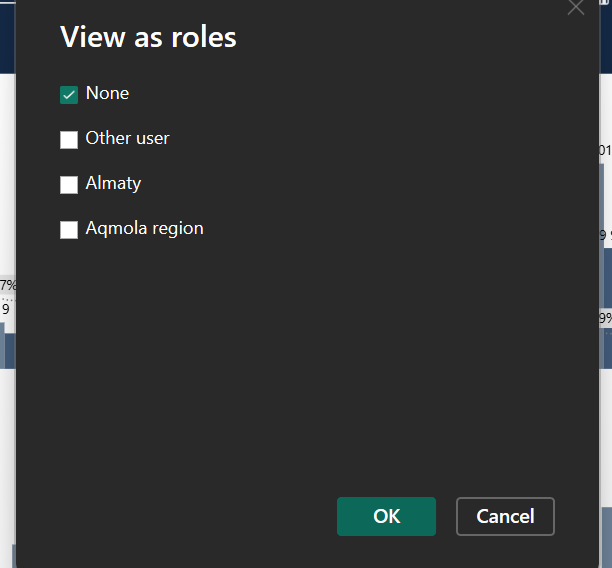
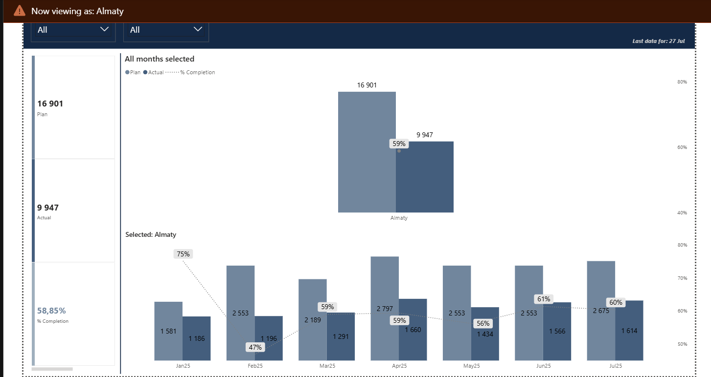

